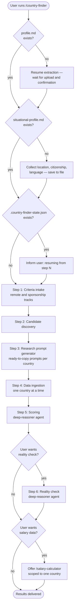

# /country-finder

Runs the full Country Finder pipeline. Collects your criteria, discovers candidate countries for remote hire and visa sponsorship as two separate tracks, generates per-country research prompts, ingests your results, scores each country against your requirements, and offers an optional reality check. Resumes from the last completed step if interrupted.

## Flow

## Steps

### 1. Profile check

Checks for `profile.md` in the workspace. If absent, reads `prompts/shared/resume-extraction-prompt.md`, waits for the user to upload their resume, and waits for explicit confirmation of the extracted profile before continuing. The profile is reused on all subsequent runs without re-extraction.

### 2. Situational profile

Checks for `situational-profile.md`. If absent, asks five questions: current location, citizenship, any known immigration friction tied to that citizenship, languages spoken, and required work language. Saves answers to `situational-profile.md` for reuse across sessions.

### 3. State check

Checks for `.country-finder-state.json`. If found, reads `last_completed_step` and informs the user which step will resume. If absent, creates the file with `last_completed_step: 0` and starts from Step 1. Updates the file after each step completes.

### 4. Step 1 — Criteria intake

Collects hard requirements for both tracks separately. Remote track: minimum acceptable monthly salary (exact amount and currency) and maximum time zone difference (in hours). Sponsorship track: relocation openness, timeline, and dealbreakers. Exclusions: countries or regions to skip entirely. Vague answers such as "reasonable," "flexible," or "close" are rejected — exact numbers and clear yes/no answers are required before proceeding.

### 5. Step 2 — Candidate discovery

Generates a grounded list of candidate countries for each track, based on the criteria from Step 1. Remote and sponsorship candidates are listed separately.

### 6. Step 3 — Research prompt generator

Generates ready-to-copy research prompts for each candidate country on each track. The user copies these prompts and runs them in separate research sessions to gather real-world data. Claude does not generate the research itself.

### 7. Step 4 — Data ingestion

Accepts pasted research results one country at a time. Validates each message: one country per message, all required fields present, no silent overwrite if a country was already stored. Data is preserved verbatim — no analysis, scoring, or summarizing during ingestion.

### 8. Step 5 — Scoring

Routed to the **deep-reasoner** subagent (Opus, high effort). Scores each stored country against the criteria from Step 1, keeping remote hire and sponsorship tracks completely separate. Each country receives a fit classification (Strong / Moderate / Weak) and a confidence level (High / Medium / Low). Every excluded country requires a specific, evidence-based reason — vague dismissals are not accepted.

### 9. Step 6 — Reality check (optional)

Claude asks before running. Routed to the **deep-reasoner** subagent. Applies a deeper audit of the scoring output. Skipped if the user declines.

### 10. Handoff

After scoring (and the optional reality check), Claude asks whether the user wants salary data for any of the results. If yes, it offers to run `/salary-calculator` scoped to a single named country.

## Stop conditions

- **Profile not yet uploaded.** Claude waits — it does not proceed or fill in placeholder data.
- **Any step instructs Claude to wait.** Claude stops and waits. No guessing, no assumptions.
- **Vague answer to a criteria question.** Claude asks again for an exact value before continuing.
- **Data ingestion receives multiple countries, missing fields, or a duplicate.** Claude stops and explains the issue before storing anything.

## See also

- [`/salary-calculator`](salary-calculator.md) — calculate local-market salaries for countries discovered here
