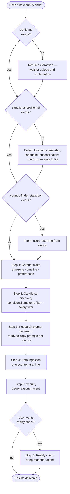

# /country-finder

Runs the full Country Finder pipeline. Collects your criteria, discovers candidate countries for remote hire and visa sponsorship as two separate tracks, generates per-country research prompts, ingests your results, scores each country against your requirements, and offers an optional reality check. Resumes from the last completed step if interrupted.

## Flow

```mermaid
flowchart TD
  Start([User runs /country-finder]) --> Profile{profile.md<br/>exists?}
  Profile -->|no| Extract[Resume extraction —<br/>wait for upload and confirmation]
  Profile -->|yes| Sit
  Extract --> Sit

  Sit{situational-profile.md<br/>exists?} -->|no| SitQ[Collect location, citizenship,<br/>language, optional salary minimum — save to file]
  Sit -->|yes| State
  SitQ --> State

  State{.country-finder-state.json<br/>exists?} -->|yes| Resume[Inform user: resuming from step N]
  State -->|no| S1
  Resume --> S1

  S1[Step 1: Criteria intake<br/>timezone · timeline · preferences] --> S2
  S2[Step 2: Candidate discovery<br/>conditional timezone filter · salary filter] --> S3
  S3[Step 3: Research prompt generator<br/>ready-to-copy prompts per country] --> S4
  S4[Step 4: Data ingestion<br/>one country at a time] --> S5
  S5[Step 5: Scoring<br/>deep-reasoner agent] --> RCQ

  RCQ{User wants<br/>reality check?} -->|no| Done
  RCQ -->|yes| S6[Step 6: Reality check<br/>deep-reasoner agent]
  S6 --> Done([Results delivered])
```

## Steps

### Profile check

Checks for `profile.md` in the workspace. If absent, reads `prompts/shared/resume-extraction-prompt.md`, waits for the user to upload their resume, and waits for explicit confirmation of the extracted profile before continuing. The profile is reused on all subsequent runs without re-extraction.

### Situational profile

Checks for `situational-profile.md`. If absent, asks six questions: current location, citizenship, any known immigration friction tied to that citizenship, languages spoken, required work language, and minimum acceptable monthly salary (or "not specified"). Saves answers to `situational-profile.md` for reuse across sessions and pipelines.

### State check

Checks for `.country-finder-state.json`. If found, reads `last_completed_step` and informs the user which step will resume. If absent, creates the file with `last_completed_step: 0` and starts from Step 1. Updates the file after each step completes.

### [Step 1 — Criteria intake](country-finder/step1-criteria-intake.md)

Collects requirements for both tracks. Remote track: maximum timezone difference (or "no limit" to skip). Sponsorship track: relocation timeline. Relocation is assumed — the question is not asked. Country preferences: any countries or regions to include or exclude from both tracks. Vague answers are rejected — specific values or explicit "no limit" / "not specified" are required.

### [Step 2 — Candidate discovery](country-finder/step2-candidate-discovery.md)

Generates a grounded list of candidate countries for each track. Timezone filtering is only applied if a limit was provided in Step 1. Salary filtering in the Remote research prompt is only applied if a minimum was specified in the situational profile. Remote and sponsorship candidates are listed separately.

### [Step 3 — Research prompt generator](country-finder/step3-research-prompt-generator.md)

Generates ready-to-copy research prompts for each candidate country on each track. The user copies these prompts and runs them in separate research sessions to gather real-world data. Claude does not generate the research itself.

### [Step 4 — Data ingestion](country-finder/step4-data-ingestion.md)

Accepts pasted research results one country at a time, or reads `cf-step3-country-research.md` automatically if it was written by Step 3's sub-agents. Validates each message: one country per message, all required fields present, no silent overwrite if a country was already stored. Data is preserved verbatim — no analysis, scoring, or summarizing during ingestion.

### [Step 5 — Scoring](country-finder/step5-scoring.md)

Claude asks whether to use the **deep-reasoner** subagent (Opus, high effort) for higher reasoning accuracy — if declined, the step runs with your current model. Scores each stored country against the criteria from Step 1, keeping remote hire and sponsorship tracks completely separate. Salary minimum check is only applied if a minimum was specified. Each country receives a fit classification (Strong / Moderate / Weak) and a confidence level (High / Medium / Low). Every excluded country requires a specific, evidence-based reason.

### [Step 6 — Reality check (optional)](country-finder/step6-reality-check.md)

Runs when the main command confirms you want it, after Step 5 completes. Claude asks whether to use the **deep-reasoner** subagent (Opus, high effort) — if declined, the step runs with your current model. Applies a deeper audit of the scoring output across six checks.

## Stop conditions

- **Profile not yet uploaded.** Claude waits — it does not proceed or fill in placeholder data.
- **Any step instructs Claude to wait.** Claude stops and waits. No guessing, no assumptions.
- **Vague answer to a criteria question.** Claude asks again for a specific value before continuing.
- **Data ingestion receives multiple countries, missing fields, or a duplicate.** Claude stops and explains the issue before storing anything.

## See also

- [`/salary-calculator`](salary-calculator.md) — calculate local-market salaries for countries discovered here
- [`/portal-finder`](portal-finder.md) — find verified job portals for a specific country
