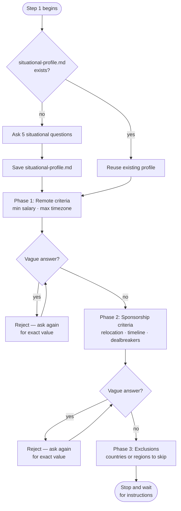

# Step 1 — Criteria intake

Collects your hard requirements for both tracks before any research begins. Claude stops and waits after this step — it does not proceed to discovery until you explicitly continue.

## Flow

## What it reads

- `profile.md` — your resume profile (must exist before this step runs)
- `situational-profile.md` — if present, reused without re-asking; if absent, Claude collects it here

## Situational profile

If `situational-profile.md` does not exist, Claude asks five questions and saves the answers to that file:

1. Current location
2. Citizenship
3. Any known immigration friction tied to that citizenship
4. Languages spoken
5. Required work environment language

These answers persist across sessions and are reused by both pipelines.

## Criteria questions

Claude asks all questions before proceeding. Vague answers are rejected — Claude will ask again until it receives an exact number, currency, or clear yes/no.

**Remote track**
- Minimum acceptable monthly salary (exact amount and currency required)
- Maximum time zone difference from your current location (exact hours required)

**Sponsorship track**
- Are you open to relocating? (yes/no required)
- Timeline or urgency for relocating
- Any dealbreakers (minimum visa duration, family relocation needs, or none)

**Exclusions**
- Countries or regions to exclude entirely from both tracks

## Output

No files are written in this step. Answers are held in memory and referenced by all subsequent steps.

## Stop condition

Claude stops after all phases are answered and waits for your instruction before continuing to Step 2.
