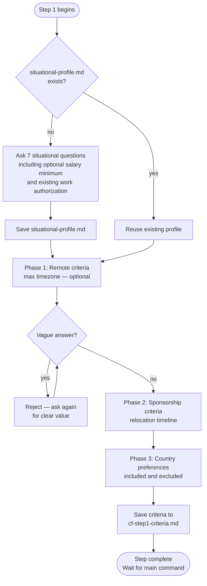

# Step 1 — Criteria intake

Collects your hard requirements for both tracks before any research begins. Claude stops and waits after this step — it does not proceed to discovery until the main command continues.

## Flow

```mermaid
flowchart TD
  Start([Step 1 begins]) --> SitCheck{situational-profile.md\nexists?}
  SitCheck -->|yes| Reuse[Reuse existing profile]
  SitCheck -->|no| SitQ[Ask 7 situational questions\nincluding optional salary minimum\nand existing work authorization]
  SitQ --> SaveSit[Save situational-profile.md]
  SaveSit --> P1
  Reuse --> P1

  P1[Phase 1: Remote criteria\nmax timezone — optional] --> Vague1{Vague answer?}
  Vague1 -->|yes| Ask1[Reject — ask again\nfor clear value]
  Ask1 --> Vague1
  Vague1 -->|no| P2

  P2[Phase 2: Sponsorship criteria\nrelocation timeline] --> P3

  P3[Phase 3: Country preferences\nincluded and excluded] --> Save[Save criteria to\ncf-step1-criteria.md]
  Save --> Stop([Step complete\nWait for main command])
```

## What it reads

- `profile.md` — your resume profile (must exist before this step runs)
- `situational-profile.md` — if present, reused without re-asking; if absent, Claude collects it here

## Situational profile

If `situational-profile.md` does not exist, Claude asks seven questions and saves the answers to that file:

1. Current location
2. Citizenship
3. Any known immigration friction tied to that citizenship
4. Languages spoken
5. Required work environment language
6. Minimum acceptable monthly salary and currency — or "not specified" to skip salary filtering
7. Existing residency or work authorization in any target country, and status there (independent work rights, a visa requiring sponsorship to change jobs, student visa, etc.) — or "not applicable"

These answers persist across sessions and are reused by both pipelines. The salary minimum, if provided, is used as a filter in Steps 2 and 5. Existing residency/work authorization, if provided, is used by Salary Calculator step3 to weigh relocation-related friction lighter for a matching country. If not provided, both are skipped.

## Criteria questions

Claude asks all questions before proceeding. Vague answers are rejected — Claude asks again until it receives a specific value or an explicit "no limit" / "not specified."

**Remote track**
- Maximum time zone difference from your current location — or "no limit" to skip timezone filtering

**Sponsorship track**
- Timeline or urgency for relocating (e.g. "within 12 months," "no rush")

Relocation is assumed — Claude does not ask whether you are open to relocating.

**Country preferences** — asked as two separate questions, not one combined free-text answer, so there's no ambiguity in classifying your reply
- Countries or regions to include
- Countries or regions to exclude

## Output

- `cf-step1-criteria.md` — criteria answers (timezone limit, relocation timeline, country preferences) written after all phases are complete. Claude confirms the save in one line rather than repeating the criteria back — you just gave them, so there's nothing new to show.
- `situational-profile.md` — written here if it did not already exist; reused by subsequent steps and the Salary Calculator pipeline

## Stop condition

Claude stops after all phases are answered and waits for the main command before continuing to Step 2.
