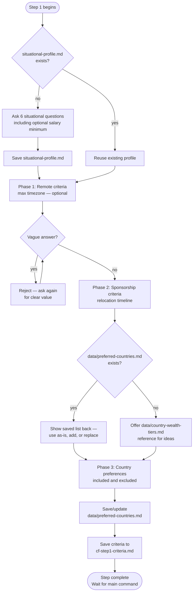

# Step 1 — Criteria intake

Collects your hard requirements for both tracks before any research begins. Claude stops and waits after this step — it does not proceed to discovery until the main command continues.

## Flow

```mermaid
flowchart TD
  Start([Step 1 begins]) --> SitCheck{situational-profile.md\nexists?}
  SitCheck -->|yes| Reuse[Reuse existing profile]
  SitCheck -->|no| SitQ[Ask 6 situational questions\nincluding optional salary minimum]
  SitQ --> SaveSit[Save situational-profile.md]
  SaveSit --> P1
  Reuse --> P1

  P1[Phase 1: Remote criteria\nmax timezone — optional] --> Vague1{Vague answer?}
  Vague1 -->|yes| Ask1[Reject — ask again\nfor clear value]
  Ask1 --> Vague1
  Vague1 -->|no| P2

  P2[Phase 2: Sponsorship criteria\nrelocation timeline] --> PrefCheck

  PrefCheck{data/preferred-countries.md\nexists?} -->|yes| ShowPref[Show saved list back —\nuse as-is, add, or replace]
  PrefCheck -->|no| OfferTiers[Offer data/country-wealth-tiers.md\nreference for ideas]
  ShowPref --> P3
  OfferTiers --> P3

  P3[Phase 3: Country preferences\nincluded and excluded] --> SavePref[Save/update\ndata/preferred-countries.md]
  SavePref --> Save[Save criteria to\ncf-step1-criteria.md]
  Save --> Stop([Step complete\nWait for main command])
```

## What it reads

- `profile.md` — your resume profile (must exist before this step runs)
- `situational-profile.md` — if present, reused without re-asking; if absent, Claude collects it here
- `data/preferred-countries.md` — if present, your saved include list is shown back for confirmation instead of asked from scratch

## Situational profile

If `situational-profile.md` does not exist, Claude asks six questions and saves the answers to that file:

1. Current location
2. Citizenship
3. Any known immigration friction tied to that citizenship
4. Languages spoken
5. Required work environment language
6. Minimum acceptable monthly salary and currency — or "not specified" to skip salary filtering

These answers persist across sessions and are reused by both pipelines. The salary minimum, if provided, is used as a filter in Steps 2 and 5. If not provided, salary filtering is skipped.

## Criteria questions

Claude asks all questions before proceeding. Vague answers are rejected — Claude asks again until it receives a specific value or an explicit "no limit" / "not specified."

**Remote track**
- Maximum time zone difference from your current location — or "no limit" to skip timezone filtering

**Sponsorship track**
- Timeline or urgency for relocating (e.g. "within 12 months," "no rush")

Relocation is assumed — Claude does not ask whether you are open to relocating.

**Country preferences**
- Countries or regions to include or exclude from both tracks
- If `data/preferred-countries.md` already exists, Claude reads it and asks whether to use it as-is, add to it, or replace it, rather than asking cold
- If it does not exist yet, Claude first offers `data/country-wealth-tiers.md` — a reference of countries grouped into 5 wealth tiers by GNI per capita — for ideas before asking
- Any new or updated include list you give is saved back to `data/preferred-countries.md` for reuse on future runs

## Output

- `cf-step1-criteria.md` — criteria answers (timezone limit, relocation timeline, country preferences) written after all phases are complete
- `situational-profile.md` — written here if it did not already exist; reused by subsequent steps and the Salary Calculator pipeline
- `data/preferred-countries.md` — written or updated here if you gave a new or changed include list

## Stop condition

Claude stops after all phases are answered and waits for the main command before continuing to Step 2.
