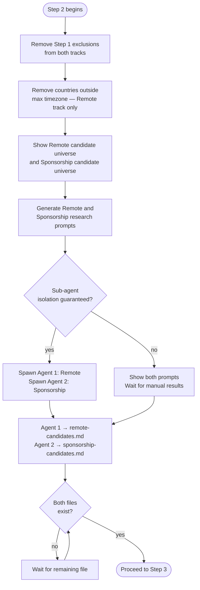

# Step 2 — Candidate discovery

Builds a grounded candidate shortlist for each track and runs two isolated research sub-agents to populate it. No country is included based on reputation alone — every candidate must be traceable to a real, checkable source.

## Flow

## What it reads

- Criteria and exclusions from Step 1
- `profile.md` and `situational-profile.md`

## Part A — Direct filtering

Applied immediately without research:

1. Remove all countries listed under Exclusions in Step 1 from both tracks.
2. For the Remote track only: calculate the UTC time zone difference between each candidate country and your current location. Remove any country outside the maximum hours you specified. This filter does not apply to the Sponsorship track — relocation removes the time zone constraint.

The filtered lists are shown before research begins:
- **Remote candidate universe**
- **Sponsorship candidate universe**

## Part B — Research sub-agents

Claude generates two ready-to-copy research prompts — one per track — then runs each as an isolated sub-agent:

| Agent | Task | Output file |
|---|---|---|
| Agent 1 | Remote Discovery Research | `remote-candidates.md` |
| Agent 2 | Sponsorship Discovery Research | `sponsorship-candidates.md` |

Each agent receives only its own prompt and has no access to the other track's reasoning. Agent 1 must not produce sponsorship output; Agent 2 must not produce remote output. If isolation cannot be guaranteed, Claude shows both prompts and waits for you to bring back the results manually.

**Remote research looks for** countries where remote hiring for your role is common practice and typical salary meets your minimum, evidenced by job boards, remote hiring reports, or company policies.

**Sponsorship research looks for** countries with a documented visa pathway for your role, your occupation on any shortage or in-demand list, and any citizenship-specific friction based on your situational profile.

## Output

- `remote-candidates.md` — researched remote-hire candidates with sources and dates
- `sponsorship-candidates.md` — researched sponsorship candidates with sources and dates

Step 3 does not begin until both files exist in the workspace.
