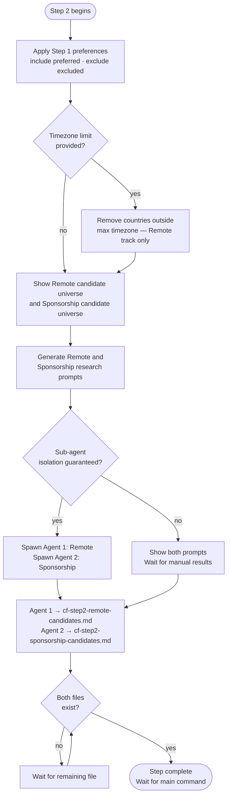

# Step 2 — Candidate discovery

Builds a grounded candidate shortlist for each track and runs two isolated research sub-agents to populate it. No country is included based on reputation alone — every candidate must be traceable to a real, checkable source.

## Flow

```mermaid
flowchart TD
  Start([Step 2 begins]) --> FilterPref[Apply Step 1 preferences\ninclude preferred · exclude excluded]
  FilterPref --> TZCheck{Timezone limit\nprovided?}
  TZCheck -->|yes| FilterTZ[Remove countries outside\nmax timezone — Remote track only]
  TZCheck -->|no| ShowLists
  FilterTZ --> ShowLists[Show Remote candidate universe\nand Sponsorship candidate universe]
  ShowLists --> GenPrompts[Generate Remote and\nSponsorship research prompts]
  GenPrompts --> Isolate{Sub-agent\nisolation guaranteed?}
  Isolate -->|yes| Agents[Spawn Agent 1: Remote\nSpawn Agent 2: Sponsorship]
  Isolate -->|no| Manual[Show both prompts\nWait for manual results]
  Agents --> Files[Agent 1 → cf-step2-remote-candidates.md\nAgent 2 → cf-step2-sponsorship-candidates.md]
  Manual --> Files
  Files --> BothDone{Both files\nexist?}
  BothDone -->|no| Wait[Wait for remaining file]
  Wait --> BothDone
  BothDone -->|yes| Done([Step complete\nWait for main command])
```

## What it reads

- Criteria and preferences from Step 1
- `profile.md` and `situational-profile.md`

## Part A — Direct filtering

Applied immediately without research:

1. Apply country preferences from Step 1: remove excluded countries from both tracks; add preferred countries to the relevant candidate universe even if they would not otherwise qualify.
2. For the Remote track only: if a maximum timezone limit was provided in Step 1, calculate the UTC time zone difference between each candidate country and your current location and remove any country outside that maximum. If no limit was provided, skip this filter. Timezone filtering never applies to the Sponsorship track.

The filtered lists are shown before research begins:
- **Remote candidate universe**
- **Sponsorship candidate universe**

## Part B — Research sub-agents

Claude generates two ready-to-copy research prompts — one per track — then runs each as an isolated sub-agent:

| Agent | Task | Output file |
|---|---|---|
| Agent 1 | Remote Discovery Research | `cf-step2-remote-candidates.md` |
| Agent 2 | Sponsorship Discovery Research | `cf-step2-sponsorship-candidates.md` |

Each agent receives only its own prompt and has no access to the other track's reasoning. Agent 1 must not produce sponsorship output; Agent 2 must not produce remote output. If isolation cannot be guaranteed, Claude shows both prompts and waits for you to bring back the results manually.

**Remote research looks for** countries where remote hiring for your role is common practice. If a minimum salary was specified in the situational profile, it is included as a filter — countries where typical salary does not meet that minimum are excluded. If no minimum was specified, this filter is omitted.

**Sponsorship research looks for** countries with a documented visa pathway for your role, your occupation on any shortage or in-demand list, and any citizenship-specific friction based on your situational profile.

## Output

- `cf-step2-remote-candidates.md` — researched remote-hire candidates with sources and dates
- `cf-step2-sponsorship-candidates.md` — researched sponsorship candidates with sources and dates

## Stop condition

Once both output files exist in the workspace, Claude stops and waits for the main command before continuing to Step 3.
