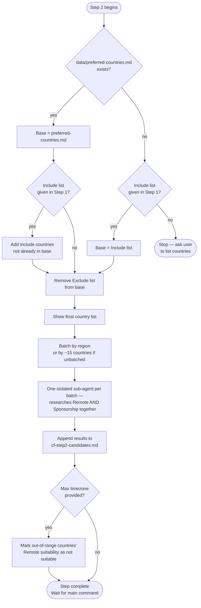

# Step 2 — Country discovery

Builds a single candidate universe, then runs isolated research sub-agents — one per region batch — to check each country for both Remote and Sponsorship suitability together. No country is included based on reputation alone — every finding must be traceable to a real, checkable source.

## Flow

## What it reads

- Criteria and preferences from Step 1 (`cf-step1-criteria.md`)
- `profile.md` and `situational-profile.md`
- `data/preferred-countries.md`, if it exists

## Part A — Build the candidate universe

No research needed — pure filtering logic, applied immediately:

1. **Base list**: `data/preferred-countries.md` if it exists; otherwise the Step 1 Include list if one was given; otherwise Step 2 stops and asks you to list the countries you want considered.
2. If the base came from `data/preferred-countries.md` **and** an Include list was also given, the Include countries are added on top (union), even if they weren't already present — placed under their matching region heading so Part B batches them correctly.
3. If an Exclude list was given, those countries are removed from the resulting base.

Other than the stop condition above, this all happens silently — Claude never announces which source it's using as the base or asks whether to use it. The resulting final country list is shown before research begins.

## Part B — Research sub-agents

The final list is batched by region, since `data/preferred-countries.md` is organized under region headings — one sub-agent per region present in the final list. If, for some reason, the list has no usable region grouping, it falls back to groups of roughly 15 countries. One isolated sub-agent is spawned per batch.

Each sub-agent's prompt embeds, as literal text (never by reference), the exact countries in its batch, the candidate's target role and skillset from `profile.md`, the minimum monthly salary from `situational-profile.md` (if specified), and the candidate's citizenship and any noted immigration friction. This keeps the prompt self-contained, since sub-agents have no access to the conversation that computed these values.

Each agent checks **both** tracks for every country in its batch — not just one track:

**Remote suitability** — is remote hiring for this role a common, well-established practice? If a salary minimum was specified, does typical remote pay meet it? Evidence from remote job boards, hiring reports, salary surveys, or company remote policies.

**Sponsorship suitability** — does a real, named work-visa pathway exist *where a local employer is the sponsor* — a standard employer-sponsored visa or work permit tied to a job offer? Digital-nomad, remote-worker, long-stay, or self-qualifying visas don't count, even if prominent in search results — they don't involve a local employer sponsoring the candidate. Is the occupation on a shortage list? That's a positive factor (and a hard requirement only for the minority of visas that explicitly say so) — its absence alone doesn't disqualify a country unless the identified pathway requires it. Citizenship-specific friction is factored in. Evidence from official immigration sources, visa program pages, or recruiter guides. A visa's salary threshold is noted as a fact, never used by itself to decide suitability — that judgment against real market data happens later, in Step 5.

Each country gets independent Suitable / Reason / Source / Date findings for each track — "no evidence found" is reported explicitly rather than guessed. If isolation can't be guaranteed, Claude shows all the batch prompts and waits for you to bring back the results manually.

## Part C — Timezone marking

If a maximum timezone difference was provided in Step 1, Claude calculates each country's UTC distance from your current location (from `situational-profile.md`) and overwrites the Remote "Suitable" value for any out-of-range country with a stated reason — it does not remove the country from the list, and Sponsorship suitability is never affected by timezone. Skipped entirely if no limit was given.

## Output

- `cf-step2-candidates.md` — every researched country, with independent Remote and Sponsorship findings (suitability, reasoning, source, date). Claude does not reproduce these per-country findings in chat — only a brief summary (countries researched, Suitable counts per track) and confirmation that the file is saved for Step 3.

## Stop condition

Once `cf-step2-candidates.md` exists (and Part C has run, if applicable), Claude stops and waits for the main command before continuing to Step 3.
