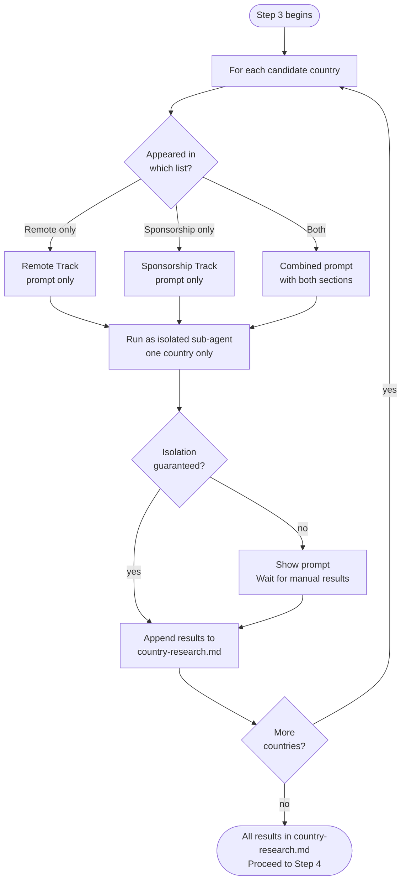

# Step 3 — Research prompt generator

Generates one ready-to-copy research prompt per candidate country, then runs each as an isolated sub-agent. Claude does not answer the research questions itself in this step.

## Flow

## What it reads

- `remote-candidates.md` and `sponsorship-candidates.md` from Step 2
- `profile.md` and `situational-profile.md`

## Prompt structure per country

Each prompt covers only the track(s) that country appeared in:

| Country appeared in | Prompt contains |
|---|---|
| Remote list only | Remote Track section only |
| Sponsorship list only | Sponsorship Track section only |
| Both lists | Both sections in one combined prompt |

**Remote Track section asks for:**
- Confirmed realistic remote salary range for your role and seniority, in local currency
- Evidence of remote hiring volume (job postings, hiring reports, company policies)
- Typical payment structure (local currency vs USD, contractor vs employee)
- Sources with dates

**Sponsorship Track section asks for:**
- Full name of the specific visa or sponsorship pathway and its official source
- Minimum salary threshold required by that visa
- Realistic employer willingness to sponsor your specific role
- Realistic visa processing time
- Any quota, cap, or annual limit
- Family or dependent sponsorship provisions
- Citizenship-specific complications based on your situational profile
- Sources with dates

## Sub-agents

Each country's prompt is run as a separate isolated sub-agent. Each agent:
- Receives only its own country's prompt
- Has no access to results for other countries
- Returns results that are appended to `country-research.md`

If isolation cannot be guaranteed, Claude shows all prompts and waits for you to bring back the results manually.

## Output

- `country-research.md` — per-country research results, appended as each agent completes

Step 4 does not begin until all results are saved to `country-research.md`.
