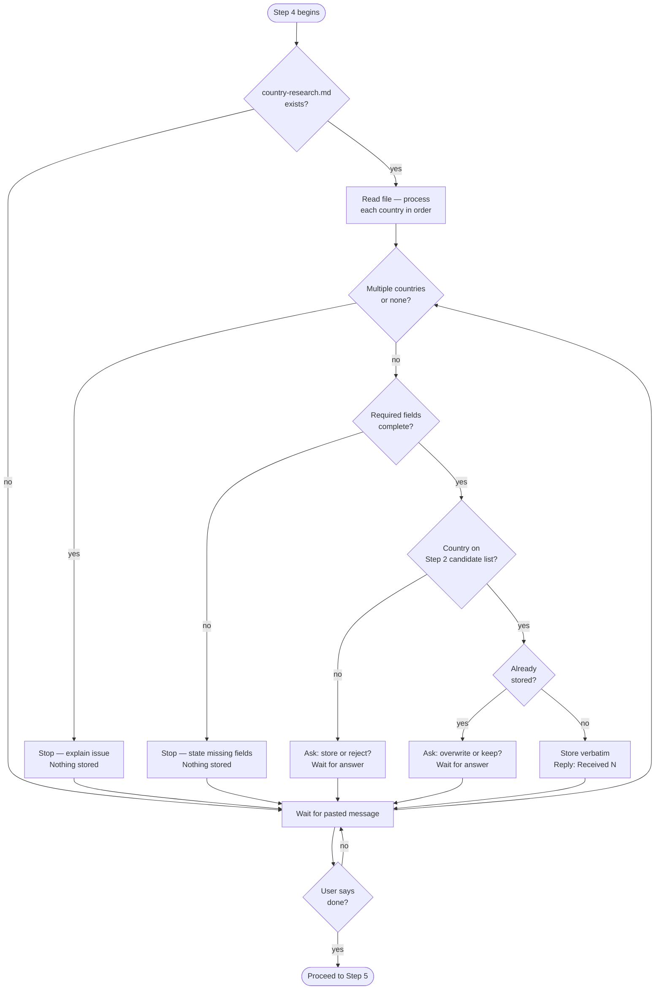

# Step 4 — Data ingestion

A strict silent-storage mode. Claude reads and stores research data one country at a time, with no analysis until you explicitly request it.

If `country-research.md` exists in the workspace (written by Step 3's sub-agents), Claude reads and processes it autonomously — no pasting required. If it does not exist, Claude waits for you to paste research data country by country.

## Flow

## What it reads

- `country-research.md` in the workspace (if present — written by Step 3 sub-agents)
- Candidate lists from Step 2 (to validate that each country was expected)

## Rules

Every rule below applies to every message received in this step:

| Situation | Claude's response |
|---|---|
| Valid, complete data for one country | `Received: N` (running count only, no names) |
| Message contains multiple countries | Stops and explains — nothing stored |
| Message contains no recognizable country | Stops and explains — nothing stored |
| Required field or section missing | States exactly what is missing — nothing stored |
| Country not on either Step 2 candidate list | Asks whether to store or reject — waits for answer |
| Country already stored | Asks whether to overwrite or keep original — waits for answer |

Claude preserves all values, wording, and formatting exactly as provided. It does not correct, improve, or reinterpret the data.

## Progress check

Type `list countries` at any point and Claude replies with the country names stored so far and which track(s) each covers. No other data is shown.

## What Claude does not do in this step

- No analysis, scoring, or ranking
- No summaries or tables
- No opinions or recommendations
- No additional actions unless explicitly instructed

## Moving to Step 5

If Claude processed `country-research.md` autonomously, it moves to Step 5 automatically once all countries are stored. If you were pasting manually, tell Claude you are done and want to proceed to scoring.
