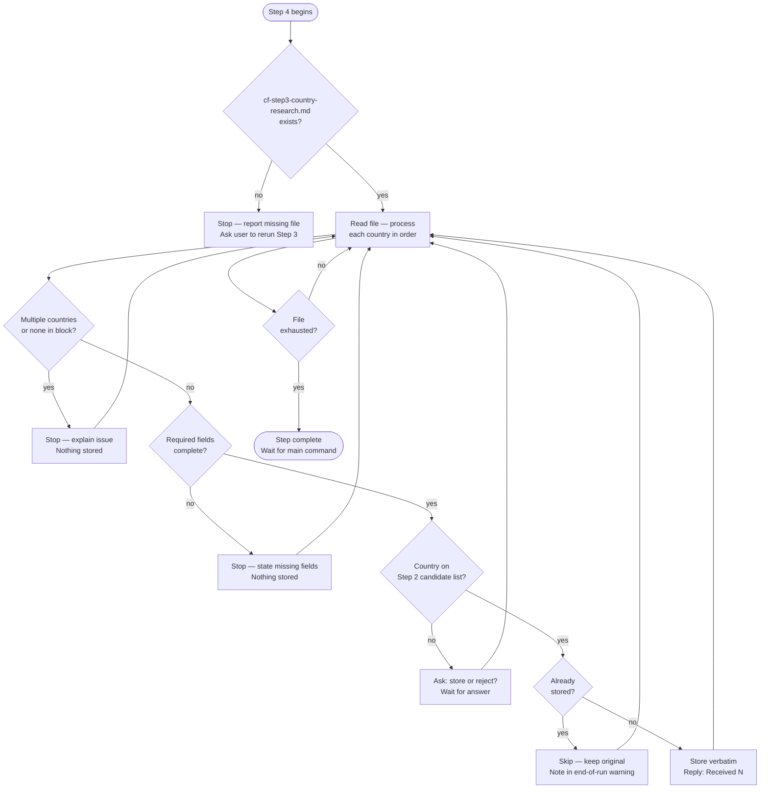

# Step 4 — Data ingestion

A strict silent-storage mode. Claude reads `cf-step3-country-research.md` written by Step 3 and processes each country's data autonomously — no pasting required. If the file is missing, Claude stops and reports it rather than waiting for manual input.

## Flow

```mermaid
flowchart TD
  Start([Step 4 begins]) --> FileCheck{cf-step3-country-research.md\nexists?}
  FileCheck -->|no| Error[Stop — report missing file\nAsk user to rerun Step 3]
  FileCheck -->|yes| ReadFile[Read file — process\neach country in order]
  ReadFile --> MultiCheck{Multiple countries\nor none in block?}
  MultiCheck -->|yes| Err1[Stop — explain issue\nNothing stored]
  Err1 --> ReadFile
  MultiCheck -->|no| FieldCheck{Required fields\ncomplete?}
  FieldCheck -->|no| Err2[Stop — state missing fields\nNothing stored]
  Err2 --> ReadFile
  FieldCheck -->|yes| ListCheck{Country on\nStep 2 candidate list?}
  ListCheck -->|no| AskStore[Ask: store or reject?\nWait for answer]
  AskStore --> ReadFile
  ListCheck -->|yes| DupCheck{Already\nstored?}
  DupCheck -->|yes| Skip[Skip — keep original\nNote in end-of-run warning]
  DupCheck -->|no| Store[Store verbatim\nReply: Received N]
  Skip --> ReadFile
  Store --> ReadFile
  ReadFile --> Done{File\nexhausted?}
  Done -->|no| ReadFile
  Done -->|yes| End([Step complete\nWait for main command])
```

## What it reads

- `cf-step3-country-research.md` — written by Step 3 sub-agents
- `cf-step2-remote-candidates.md` and `cf-step2-sponsorship-candidates.md` — used to validate that each country was expected

## Rules

| Situation | Claude's response |
|---|---|
| Valid, complete data for one country | `Received: N` (running count only, no names) |
| File not found | Stops — reports missing file, asks user to ensure Step 3 completed |
| Block contains multiple countries | Stops and explains — nothing stored |
| Block contains no recognizable country | Stops and explains — nothing stored |
| Required field or section missing | States exactly what is missing — nothing stored |
| Country not on either Step 2 candidate list | Asks whether to store or reject — waits for answer |
| Country already stored | Skips it, keeps original, notes it in a warning after processing |

Claude preserves all values, wording, and formatting exactly as provided. It does not correct, improve, or reinterpret the data.

## What Claude does not do in this step

- No analysis, scoring, or ranking
- No summaries or tables
- No opinions or recommendations
- No additional actions unless explicitly instructed

## Stop condition

Once all countries from `cf-step3-country-research.md` have been processed, Claude stops and waits for the main command. Any skipped duplicates are reported in a warning before stopping.
