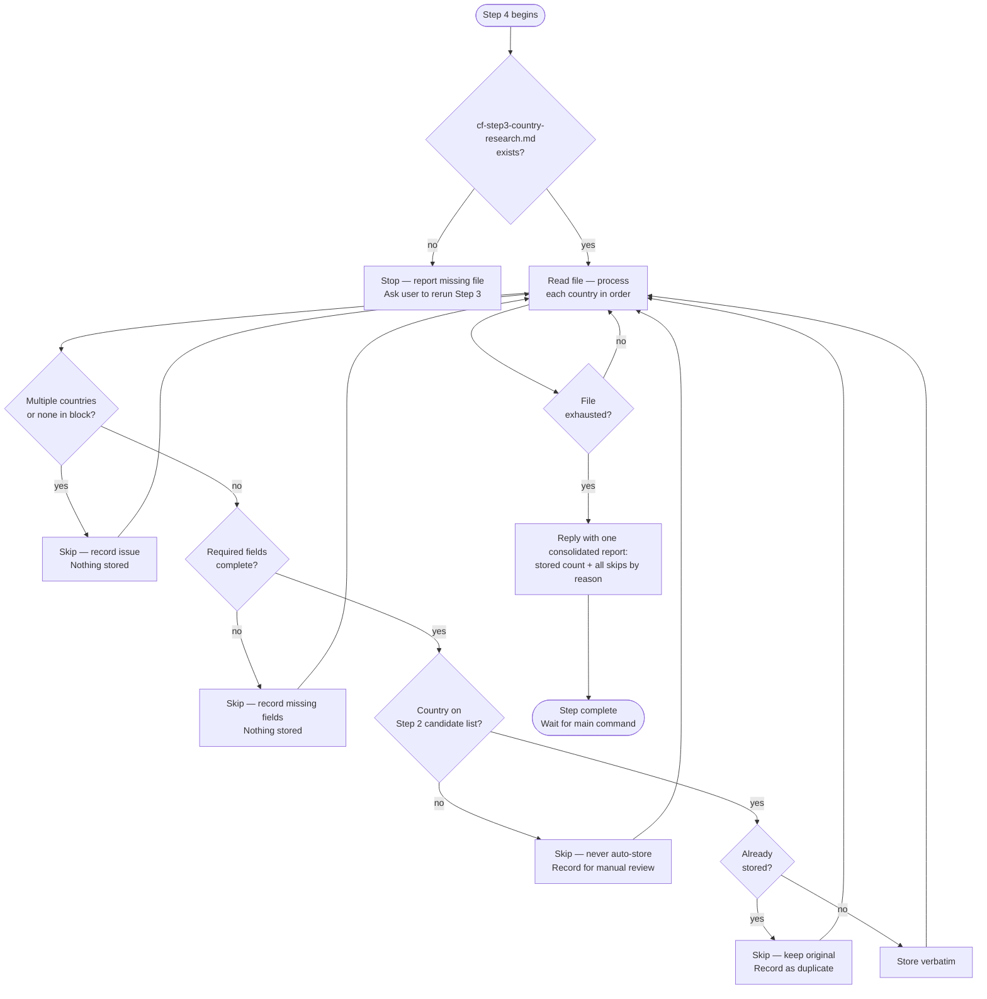

# Step 4 — Data validation

A strict silent-storage mode. Claude reads `cf-step3-country-research.md` written by Step 3 and processes each country's data autonomously — no pasting required. If the file is missing, Claude stops and reports it rather than waiting for manual input.

## Flow

## What it reads

- `cf-step3-country-research.md` — written by Step 3 sub-agents
- `cf-step2-candidates.md` — used to validate that each country was marked suitable for at least one track

## Rules

This runs fully automated, with no pause between countries — bad items are skipped and recorded, never halted on.

| Situation | Claude's response |
|---|---|
| File not found | Stops — reports missing file, asks user to ensure Step 3 completed |
| Block contains multiple countries | Skips it and records the issue — nothing stored |
| Block contains no recognizable country | Skips it and records the issue — nothing stored |
| Required field or section missing | Skips it and records what's missing — nothing stored |
| Country not marked suitable for any track in Step 2 | Never stored automatically — skipped and recorded for manual review |
| Country already stored | Skips it, keeps original, records it as a duplicate |
| Valid, complete data for one country | Stored silently |

Claude preserves all values, wording, and formatting exactly as provided. It does not correct, improve, or reinterpret the data.

## What Claude does not do in this step

- No analysis, scoring, or ranking
- No summaries or tables
- No opinions or recommendations
- No additional actions unless explicitly instructed

## Stop condition

Once all countries from `cf-step3-country-research.md` have been processed, Claude writes all successfully stored countries to `cf-step4-country-data.md` (which Step 5 scores next), replies with one consolidated report (stored count, plus every skip grouped by reason — malformed, missing fields, duplicate, not marked suitable for any track), then stops and waits for the main command.
