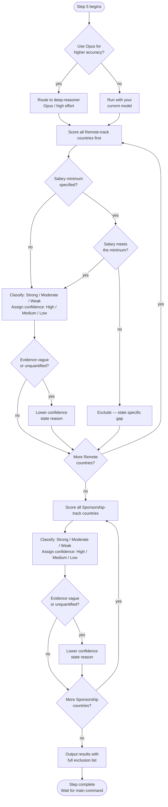

# Step 5 — Scoring

Scores every stored country against your criteria, keeping Remote and Sponsorship tracks completely separate. Before running, Claude asks whether to use the **deep-reasoner** subagent (Opus, high effort) for higher reasoning accuracy. If you decline, the step runs with your current model.

## Flow



## What it reads

- All country data stored in Step 4
- Salary minimum from situational profile (optional — skipped if not specified)
- Timezone limit from Step 1 (informational — already applied in Step 2)
- Citizenship-specific friction from situational profile

## Batching rule

All Remote-track countries are scored first, all the way through, before Sponsorship scoring begins for any country. Tracks are never interleaved.

## Remote track scoring

For each country with Remote data stored:

1. If a minimum monthly salary was specified in the situational profile, check whether the confirmed salary meets or exceeds it. If not, exclude with the specific gap stated (e.g. "confirmed salary $X, below your minimum of $Y"). If no minimum was specified, skip this check.
2. If it passes: classify Remote fit as **Strong**, **Moderate**, or **Weak**.
3. Assign confidence: **High**, **Medium**, or **Low**.
4. Give brief reasoning referencing actual stored evidence, not assumption.

## Sponsorship track scoring

For each country with Sponsorship data stored:

1. If a visa minimum salary threshold was reported and Salary Calculator figures exist, note whether they clear the threshold. If no figures exist, note the threshold as informational only.
2. Classify Sponsorship fit as **Strong**, **Moderate**, or **Weak**.
3. Assign confidence: **High**, **Medium**, or **Low**.
4. Give brief reasoning referencing actual stored evidence, including any citizenship-specific friction from the situational profile.

## Evidence quality rule

If the stored research uses vague or unquantified language ("sometimes," "generally friendly," "fairly common"), confidence is lowered and the reason is stated. Vague claims are never treated as strong evidence.

## Exclusion transparency rule

Every country that was on a Step 2 candidate list but does not appear in the final results must be listed separately with a specific, evidence-based reason. "General reputation" is not an acceptable reason. If no data was ever stored for that country and track, that is stated plainly.

## Output format

```
Remote Track Results
- [Scored countries: fit, confidence, brief reasoning]
- [Excluded countries: specific reason]

Sponsorship Track Results
- [Scored countries: fit, confidence, brief reasoning]
- [Excluded countries: specific reason]

Summary
- Remote: [N] scored, [N] excluded
- Sponsorship: [N] scored, [N] excluded
```

## Stop condition

After outputting results, Claude stops and waits for the main command. The main command then asks whether to run the Step 6 reality check.
