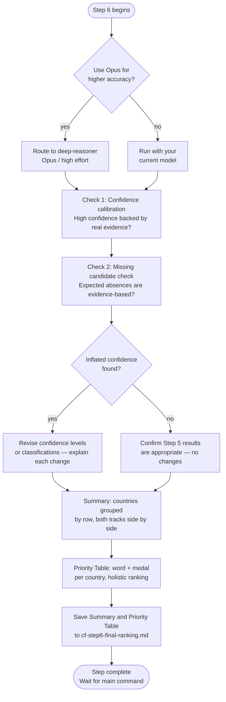

# Step 6 — Final Ranking

A focused audit of the Step 5 scoring output, followed by a prioritized Country Finder result — the Priority Table. Always runs; unlike the rest of the pipeline this is the only step with no skip option, since it's what produces the final result. Claude asks whether to use the **deep-reasoner** subagent (Opus, high effort) for higher reasoning accuracy on the audit itself. If you decline, the step runs with your current model.

## Flow

## Purpose

Challenges the two aspects of Step 5 scoring that Step 5 cannot self-audit: whether high-confidence labels are genuinely earned, and whether any expected countries are absent due to process gaps rather than evidence-based elimination.

## What it reads

- `cf-step5-scoring-results.md` — full scoring output from Step 5, and the sole authoritative source for the Priority Table's Remote Fit / Sponsorship Fit columns
- `cf-step2-candidates.md` — the full candidate universe, used to detect countries that were candidates but never reached Step 4
- `cf-step4-country-data.md`, `cf-step1-criteria.md`, `situational-profile.md`, and `profile.md` — the underlying evidence, criteria, situational profile, and candidate profile (the last used for the Priority Table's medal assignment)

All inputs come from workspace files, so the audit is safe to route to the isolated deep-reasoner subagent.

## The two checks

**1. Confidence calibration check**

For every country marked High confidence: verifies that the underlying evidence is genuinely specific, sourced, and dated — not just confidently worded. Flags any confidence level that seems inflated relative to the actual evidence quality and explains why.

**2. Missing candidate check**

Compares the Step 2 candidate list against the countries that reached Steps 4 and 5 (and also considers any commonly expected country that is absent). For each missing country, states whether the absence was a genuine evidence-based elimination (citing the reason from earlier steps) or a process gap — such as being a Step 2 candidate that was never researched or never reached Step 4.

## Recalibration

Only if the confidence calibration check found inflated confidence levels:
- The affected country's confidence level is revised
- If inflated confidence was masking a genuinely weaker fit, the classification is revised too
- Each change is explained with the evidence that caused it

If recalibration is not supported, Step 5 results are explicitly confirmed as appropriate and left unchanged.

## Summary

After the recalibration verdict, Claude shows a Summary directly in chat — not just in the saved file — that reorganizes Step 5's final scores (including any revisions from this step) by country rather than by track, each country showing its Remote and Sponsorship fit side by side. This is the one step in the pipeline where Claude does show full output in chat, since it's the final, human-facing result.

| Country | Remote | Sponsorship |
|---|---|---|
| Example A | Strong — High | Moderate — Medium |
| Example B | Excluded | Strong — High |
| Example C | not scored (no data) | Weak — Low |

Rules for the table:

- **Excluded** — the country was actively eliminated on that track during Step 5. The reason is not restated here.
- **not scored (no data)** — no research was ever ingested for that country on that track. This is distinct from Excluded.
- If Step 6 revised a country's confidence level or classification, a short one-line note appears beneath it.

Countries flagged by the Missing Candidate Check that were never researched on either track are listed separately under **"Flagged but not researched"** — they are not forced into the table.

The section closes with counts:
- Remote: [N] scored, [N] excluded, [N] not scored (no data)
- Sponsorship: [N] scored, [N] excluded, [N] not scored (no data)

The Summary itself contains no ranking, recommendations, or interpretation beyond the classifications above — ranking is reserved for the Priority Table below.

## Priority Table

A second table, shown directly in chat right after the Summary, using the same final classifications. Each row's Tier has two independent parts:

**Word** — which application track is usable, derived from that country's Remote/Sponsorship fit values as recorded in `cf-step5-scoring-results.md` — Step 5 is the authoritative source here. Even if the Summary above revised a country's classification during recalibration, the Priority Table's Fit columns still trace back to Step 5's original ratings, never Step 6's:

| Word | Condition |
|---|---|
| Both | Remote Fit and Sponsorship Fit each Strong or Moderate |
| Remote | Remote Fit Strong or Moderate; Sponsorship Fit Weak or unavailable |
| Sponsorship | Sponsorship Fit Strong or Moderate; Remote Fit Weak or unavailable |
| Limited | Neither track reaches Moderate |

**Medal** (🥇 / 🥈 / 🥉 / 🎗️) — a holistic judgment of expected application priority for this specific candidate, deliberately *not* calculated mechanically from the two fit values or from confidence alone. This is where Step 6's own audit work comes in: its evidence-quality and confidence-calibration findings inform how much the underlying evidence is trusted, without ever changing the Fit values themselves. Weighed against seniority/skills/industry match (from `profile.md`), job opportunity volume and recency, remote-location acceptance, sponsorship evidence for the specific profession, salary compatibility, visa practicality, language/citizenship barriers, and evidence strength (as informed by the Confidence Calibration Check). There's no fixed quota per medal — a Moderate/Moderate "Both" country can still land 🥉 if conversion factors (hiring volume, evidence strength, language barriers) are weak.

| Country | Tier | Remote Fit | Sponsorship Fit |
|---|---|---|---|
| 🏳️ Example Country | 🥇 Both | Strong | Moderate |
| 🏳️ Example Country | 🥈 Remote | Strong | Weak |
| 🏳️ Example Country | 🥉 Sponsorship | Weak | Moderate |
| 🏳️ Example Country | 🎗️ Limited | Weak | Weak |

Sorted by medal first (🥇 → 🎗️), then within the same medal by expected chance of landing a job there (same factors as above, never alphabetical as a first pass) — with alphabetical order only as the last-resort tie-breaker, after domain/industry match, named-employer evidence, accessibility/sponsorship willingness, salary/timeline, and evidence confidence have all been weighed. Remote Fit and Sponsorship Fit values are restricted to Strong / Moderate / Weak / — (em dash, covering unavailable, excluded, and unresearched alike). No notes, citations, or footnotes in this table — every country from the Summary appears exactly once.

## Output

- `cf-step6-final-ranking.md` — the Summary table and the Priority Table, saved together after both are output. This is the final, post-audit classification — later steps or pipelines (e.g. Salary Calculator) should prefer it over `cf-step5-scoring-results.md` if both exist.

## Completion message

After saving, Claude tells you the pipeline is complete and where the results live, so the conversation doesn't just trail off after the table: *"Country Finder is complete. Results are saved to `cf-step6-final-ranking.md` if you want to revisit them later without re-running the pipeline — start with your 🥇 countries above."*

## Stop condition

After the completion message, Claude stops and waits for the main command.
