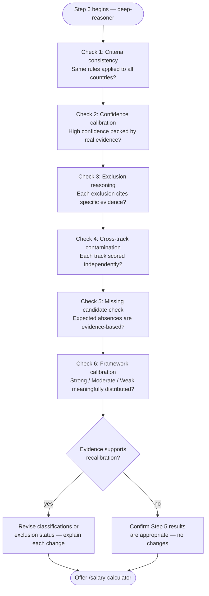

# Step 6 — Reality check (optional)

An independent audit of the Step 5 scoring output. Claude asks before running this step — it only proceeds if you confirm. Routed to the **deep-reasoner** subagent (Opus, high effort).

## Flow

## Purpose

The reality check challenges the scoring results from Step 5. It does not automatically defend or attack them — it follows the evidence. Recalibration only happens if the evidence genuinely supports it.

## What it reads

- All data and results from Steps 1 through 5

## The six checks

**1. Criteria consistency check**

- Was your Step 1 salary minimum applied the same way to every Remote-track country?
- Was the time zone limit applied only to Remote, never to Sponsorship?
- Were your Step 1 dealbreakers applied consistently to every Sponsorship-track country?

Any inconsistency is stated explicitly.

**2. Confidence calibration check**

For every country marked High confidence: verifies that the underlying evidence is genuinely specific, sourced, and dated — not just confidently worded. Flags any confidence level that seems inflated relative to the actual evidence quality.

**3. Exclusion reasoning check**

Re-examines every exclusion from Step 5. Confirms each one cites a specific fact from stored data, not a vague or reputation-based dismissal. Flags any generic dismissal that lacks real evidence.

**4. Cross-track contamination check**

For any country scored on both tracks: checks whether the Sponsorship reasoning was influenced by the Remote judgment or vice versa. Each track's score must stand on its own evidence independently.

**5. Missing candidate check**

Identifies any country that would commonly be expected to appear but is absent. For each one, states whether the absence was a genuine evidence-based elimination or a process gap (never researched, never pasted into Step 4).

**6. Framework calibration check**

Assesses whether the Strong / Moderate / Weak classification is meaningfully distinguishing between countries, or whether most countries clustered into a single bucket — which would indicate criteria that are too loose or too strict.

## Recalibration

Only if the evidence genuinely supports it:
- Specific country classifications, confidence levels, or exclusion status may be revised
- Each change is explained with the evidence that caused it

If recalibration is not supported, the Step 5 results are explicitly confirmed as appropriate and left unchanged.

## After the reality check

Claude asks whether you want salary data for any of the results and offers to run `/salary-calculator` scoped to a single named country.
