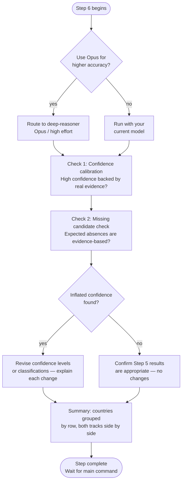

# Step 6 — Reality check (optional)

A focused audit of the Step 5 scoring output across two checks. Runs when the main command confirms you want it. Claude asks whether to use the **deep-reasoner** subagent (Opus, high effort) for higher reasoning accuracy. If you decline, the step runs with your current model.

## Flow

```mermaid
flowchart TD
  Start([Step 6 begins]) --> OpusQ{Use Opus for\nhigher accuracy?}
  OpusQ -->|yes| DeepReasoner[Route to deep-reasoner\nOpus / high effort]
  OpusQ -->|no| CurrentModel[Run with your\ncurrent model]
  DeepReasoner --> C1
  CurrentModel --> C1[Check 1: Confidence calibration\nHigh confidence backed by real evidence?]
  C1 --> C2[Check 2: Missing candidate check\nExpected absences are evidence-based?]
  C2 --> Recal{Inflated confidence\nfound?}
  Recal -->|yes| Revise[Revise confidence levels\nor classifications — explain each change]
  Recal -->|no| Confirm[Confirm Step 5 results\nare appropriate — no changes]
  Revise --> Summary[Summary: countries grouped\nby row, both tracks side by side]
  Confirm --> Summary
  Summary --> Done([Step complete\nWait for main command])
```

## Purpose

Challenges the two aspects of Step 5 scoring that Step 5 cannot self-audit: whether high-confidence labels are genuinely earned, and whether any expected countries are absent due to process gaps rather than evidence-based elimination.

## What it reads

- `cf-step5-scoring-results.md` — full scoring output from Step 5

## The two checks

**1. Confidence calibration check**

For every country marked High confidence: verifies that the underlying evidence is genuinely specific, sourced, and dated — not just confidently worded. Flags any confidence level that seems inflated relative to the actual evidence quality and explains why.

**2. Missing candidate check**

Identifies any country that would commonly be expected to appear but is absent from either track's results. For each one, states whether the absence was a genuine evidence-based elimination (citing the reason from earlier steps) or a process gap — such as never being researched or never reaching Step 4.

## Recalibration

Only if the confidence calibration check found inflated confidence levels:
- The affected country's confidence level is revised
- If inflated confidence was masking a genuinely weaker fit, the classification is revised too
- Each change is explained with the evidence that caused it

If recalibration is not supported, Step 5 results are explicitly confirmed as appropriate and left unchanged.

## Summary

After the recalibration verdict, Claude outputs a Summary that reorganizes Step 5's final scores (including any revisions from this step) by country rather than by track — each country showing its Remote and Sponsorship fit side by side.

| Country | Remote | Sponsorship |
|---|---|---|
| Example A | Strong — High | Moderate — Medium |
| Example B | Excluded | Strong — High |
| Example C | not scored (no data) | Weak — Low |

Rules for the table:

- **Excluded** — the country was actively eliminated on that track during Step 5. The reason is not restated here.
- **not scored (no data)** — no research was ever ingested for that country on that track. This is distinct from Excluded.
- If Step 6 revised a country's confidence level or classification, a short one-line note appears beneath it.

Countries flagged by the Missing Candidate Check that were never researched on either track are listed separately under **"Flagged but not researched"** — they are not forced into the table.

The section closes with counts:
- Remote: [N] scored, [N] excluded, [N] not scored (no data)
- Sponsorship: [N] scored, [N] excluded, [N] not scored (no data)

No ranking, no recommendations, no interpretation.

## Stop condition

After the summary, Claude stops and waits for the main command.
