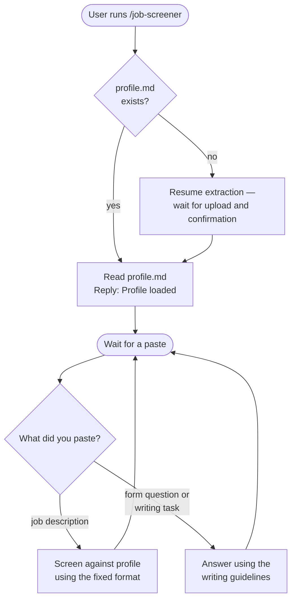

# /job-screener

Screens job descriptions against your resume profile and returns a structured match report — a verdict, pros and cons with hard-blocker tagging, salary and application method when stated, and a fixed missing-information checklist. It also drafts answers to application form questions and other application writing in a consistent tone. Requires a resume. Paste one job description at a time; re-invoke if the session drifts.

## Usage

```
/claude-compass:job-screener
```

Run it once at the top of a chat. Claude loads your profile and waits. Then paste a job description to get a screen, or paste application form questions to get drafted answers.

## Flow



## Before the step runs

### Profile check

Checks for `profile.md` in the workspace. If absent, reads `prompts/shared/resume-extraction-prompt.md`, waits for the user to upload their resume, and waits until `profile.md` is produced. The profile is reused on all subsequent runs without re-extraction.

### [Step 1 — Match analysis](job-screener/step1-match-analysis.md)

Reads `profile.md` as the canonical candidate profile, replies "Profile loaded. Paste a job description to screen," then waits. Each pasted job description is screened against the profile using a fixed output format. Pasted form questions or writing tasks are answered using the writing guidelines instead.

## No state file

Unlike Country Finder and Salary Calculator, this command keeps no state file and nothing to resume. Each screen is independent. If the session drifts off the format over a long run, re-invoke the command — it reloads the profile and format cheaply, since `profile.md` already exists.

## See also

- [`/country-finder`](country-finder.md) — discover which countries are viable for remote hire or visa sponsorship
- [`/salary-calculator`](salary-calculator.md) — calculate realistic local-market salaries for a target country
- [`/portal-finder`](portal-finder.md) — find verified job portals for a specific country
