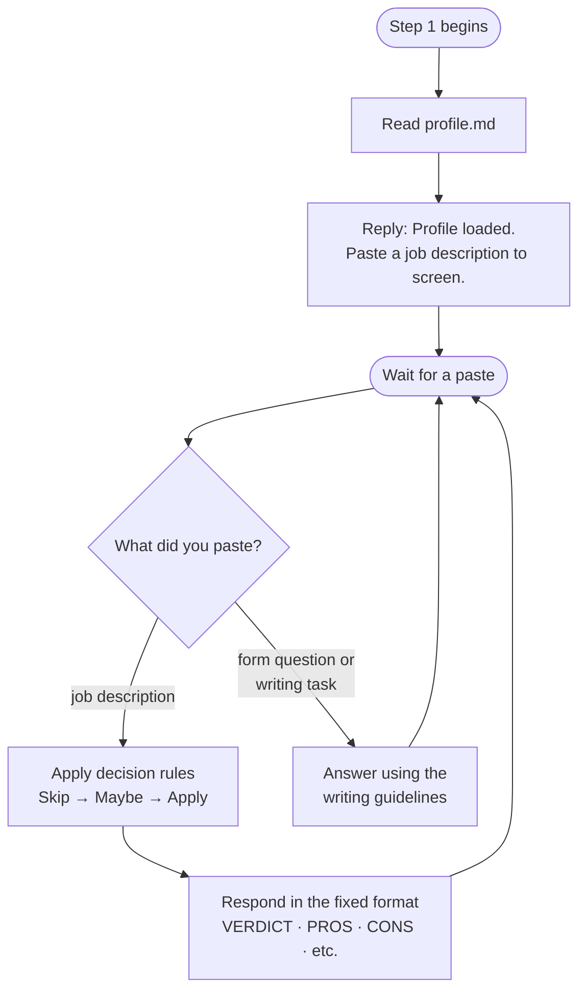

# Step 1 — Match analysis

Reads `profile.md` as the canonical candidate profile, then waits. Each pasted job description is screened against the profile using a fixed format. Pasted form questions or writing tasks are answered using the writing guidelines instead.

## Flow

## What it reads

- `profile.md` — the canonical candidate profile

## Decision rules

Applied silently, in order — the first that matches wins:

- **❌ Skip** — one or more 🚫 blockers present, regardless of other fit.
- **⚠️ Maybe** — no 🚫 blockers, but two or more required (not preferred) qualifications are clearly unmet, or so many required qualifications are unverifiable that fit cannot be judged.
- **✅ Apply** — no 🚫 blockers, and most required qualifications are met. Unknown or unverifiable requirements do not count against an Apply; they are noted as unknown.

## Output format

Each job description is screened into these sections:

| Section | Contents |
|---|---|
| `[VERDICT]` | One line stating the chosen decision |
| `[APPLICATION METHOD]` | Included only if the JD explicitly specifies how or where to apply |
| `[SALARY]` | Included only if the JD explicitly states a salary range |
| `[PROS]` | Bullet points |
| `[CONS]` | Bullet points; 🚫 marks hard blockers only |
| `[MISSING INFORMATION]` | Which items from the fixed checklist the JD does not state |

## Hard blockers (🚫)

🚫 is reserved for objective, non-negotiable disqualifiers, since a single 🚫 forces a ❌ Skip:

- missing work authorization for the job's location
- a required security clearance the candidate does not hold
- a required working language the candidate does not speak
- a mandatory on-site location the candidate cannot be at, with no remote or relocation option stated
- a mandatory timezone or working-hours overlap the candidate cannot meet
- a legally or contractually mandatory certification the candidate does not hold
- the role's core technology or stack is one the candidate does not have — not merely one item missing from a longer required list

Years-of-experience gaps are not hard blockers unless the JD states a hard minimum and the gap is large. Unclear-if-mandatory requirements are treated as cons, not blockers. Unmet preferred qualifications are labeled "preferred, not required" and never marked 🚫.

## Missing information checklist

Every screen reports which of these the JD does not explicitly state (or "None — all covered"):

- salary
- visa sponsorship
- relocation support
- remote policy
- work authorization
- timezone or working-hours overlap
- employment type (permanent / contract)

An item unstated here is unknown, not a negative — it can never be a 🚫 blocker or a con on its own.

## Form questions and application writing

When you paste application form questions or ask Claude to write anything for the application (emails, answers, cover letters, forms, or messages), Claude answers using a fixed set of writing guidelines: plain English, short and compact, a calm and slightly detached tone, no unnecessary hyphens, and no overpraising the company.

## Drift resistance

Before each screen, Claude re-anchors to the exact format and rules and silently corrects itself if it notices drift. Over a long session this can still slip — re-invoke the command to reset.
