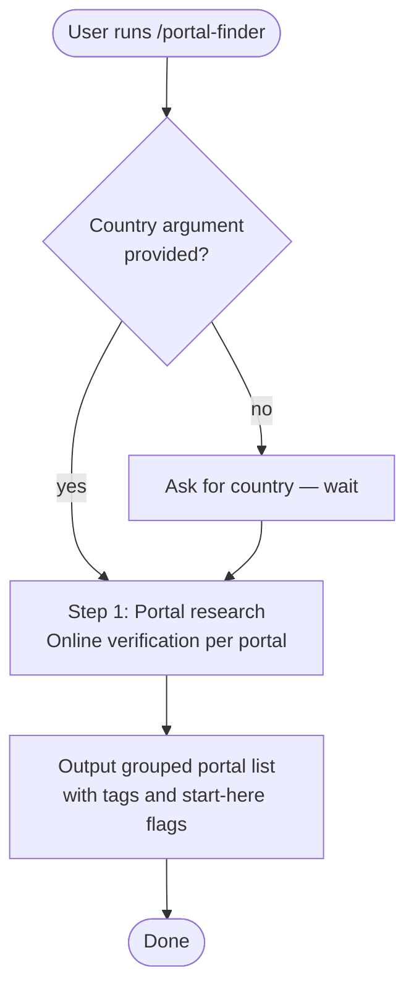

# /portal-finder

Finds verified job portals for IT/tech roles in a specified country. Accepts the country as an optional argument — if omitted, Claude asks before doing anything. Researches portals online rather than relying on general knowledge, and verifies each tag attribute directly on the portal's own site.

## Usage

```
/claude-compass:portal-finder Germany
/claude-compass:portal-finder
```

If you provide a country argument, Claude uses it directly. If you omit it, Claude asks first and waits for your answer.

## Flow



## Before the step runs

### Country

Claude checks whether a country was provided as an argument. If not, it asks and waits before proceeding.

### [Step 1 — Portal research](portal-finder/step1-portal-research.md)

Researches job portals for IT/tech roles in the target country online. Portals are organized by type into five mutually exclusive groups: general job boards, tech-specific boards, recruitment agencies, professional & community networks, and government/official portals. Geographic scope (country-dedicated vs global) is noted per portal rather than used as a group. Each portal is tagged with verified attributes only. Within each group, the 2–3 portals to start with first are flagged. Anything noteworthy but outside the structure — deprecated portals, shared ownership, foreign-applicant restrictions — is flagged with ⚠️.

## Tags

Tags are only applied when verified true on the portal's own site — not based on blog posts or list articles.

| Tag | Meaning |
|-----|---------|
| 🌍 Remote | Dedicated remote-jobs filter or tag, or remote-only portal |
| 🛂 Sponsorship | Dedicated visa-sponsorship filter or tag for eligible roles |
| 🔓 No account needed | Browse and apply without registering at any point in the flow |

## Stop conditions

- **Country not provided as argument.** Claude asks and waits — it does not guess or default to a country.
- **Online research finds no portals matching a group.** Claude omits that group rather than inventing entries.

## See also

- [`/country-finder`](country-finder.md) — discover which countries are viable for remote hire or visa sponsorship
- [`/salary-calculator`](salary-calculator.md) — calculate realistic local-market salaries for a target country
- [`/job-screener`](job-screener.md) — screen job descriptions against your resume profile
