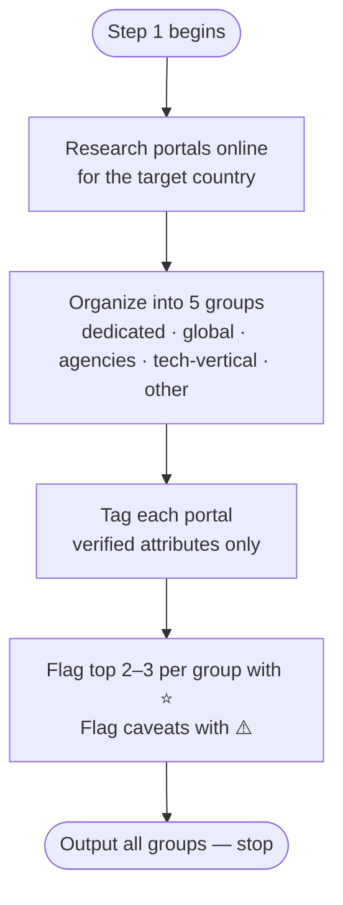

# Step 1 — Portal research

Researches job portals for IT/tech roles in the target country online. Every tag attribute is verified directly on the portal's own site — not from blog posts or listicle articles.

## Flow

## What it uses

- Country — established before this step runs

## Groups

Portals are organized into exactly these five groups, in this order:

1. **Country-dedicated portals** — built primarily or exclusively for the target country
2. **Global/multi-country portals** — international platforms where the target country is one market; remote-first boards appear as a labeled subset within this group
3. **Recruitment agencies** — agencies actively placing IT/tech candidates in the target country
4. **IT/tech-vertical boards** — boards specific to or especially strong for tech roles in the target country
5. **Other** — only if a portal genuinely doesn't fit groups 1–4; gets its own group name rather than being forced in

If no portals fit a group, that group is omitted rather than padded with weak entries.

## Tags

Each tag is only applied when verified true on the portal's own site:

| Tag | Verified condition |
|-----|--------------------|
| 🌍 Remote | Dedicated remote-jobs filter or tag, or portal is remote-only — keyword search does not count |
| 🛂 Sponsorship | Dedicated visa-sponsorship filter or tag — keyword search does not count |
| 🔓 No account needed | Browse and apply without registering at any point in the flow — login required at apply step disqualifies |

## Per-portal output

For each portal:
- Name
- One-line description of its real strength for an IT/tech job seeker
- Verified tags

Within each group, ⭐ marks the 2–3 portals to start with first.

## Warning flags

⚠️ flags anything outside the structure but worth knowing:
- Portal is dead or deprecated despite still ranking in searches
- Two portals in the list are owned by the same parent company
- Portal is government-only or closed to foreign applicants
- Any significant caveat affecting an international candidate

## Stop condition

Claude outputs all groups in a single response, in order from group 1 to 5, then stops. No follow-up advice or recommendations are added.
