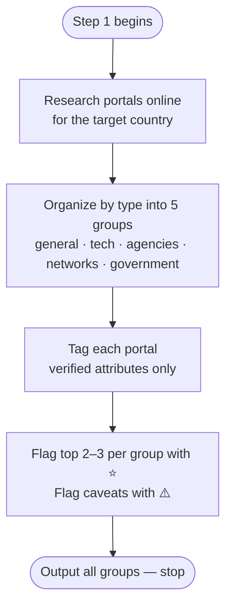

# Step 1 — Portal research

Researches job portals for IT/tech roles in the target country online. Every tag attribute is verified directly on the portal's own site — not from blog posts or listicle articles.

## Flow

## What it uses

- Country — established before this step runs

## Groups

Portals are organized **by type** into these five mutually exclusive groups, in this order:

1. **General job boards** — broad portals that list many fields including tech
2. **Tech-specific boards** — boards built for IT, software, data, or related tech roles
3. **Recruitment agencies** — agencies actively placing IT/tech candidates in the target country
4. **Professional & community networks** — professional networks and community-run boards where tech roles are posted (e.g. LinkedIn, Wellfound, startup "who's hiring" boards, active local developer communities)
5. **Government / official portals** — national employment-service or official visa-linked job portals, if any

Each portal goes in exactly one group. Geographic scope (country-dedicated vs global/multi-country) is not a group — it is noted per portal, since it changes how much of a portal's listings are relevant. Remote-first boards are captured by the 🌍 tag and placed under General or Tech-specific by their focus, not a separate group. If a portal fits none of the five, it gets its own clearly named group rather than being forced in. If no portals fit a group, that group is omitted rather than padded with weak entries.

## Tags

Each tag is only applied when verified true on the portal's own site:

| Tag | Verified condition |
|-----|--------------------|
| 🌍 Remote | Dedicated remote-jobs filter or tag, or portal is remote-only — keyword search does not count |
| 🛂 Sponsorship | Dedicated visa-sponsorship filter or tag — keyword search does not count |
| 🔓 No account needed | Browse and apply without registering at any point in the flow — login required at apply step disqualifies |

## Per-portal output

For each portal:
- Name
- Scope — country-dedicated or global/multi-country
- One-line description of its real strength for an IT/tech job seeker
- Verified tags

Within each group, ⭐ marks the 2–3 portals to start with first.

## Warning flags

⚠️ flags anything outside the structure but worth knowing:
- Portal is dead or deprecated despite still ranking in searches
- Two portals in the list are owned by the same parent company
- Portal is restricted to citizens or residents and not open to foreign applicants
- Any significant caveat affecting an international candidate

## Stop condition

Claude outputs all groups in a single response, in order from group 1 to 5, then stops. No follow-up advice or recommendations are added.
