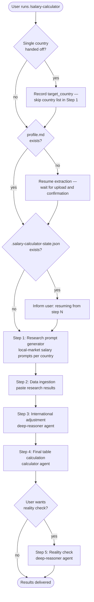

# /salary-calculator

Runs the full Salary Calculator pipeline. Generates ready-to-copy research prompts for local-market salary data, ingests your research results, applies international purchasing-power adjustments, and produces a final salary table with shown calculations. Runs standalone or scoped to a single country handed off from Country Finder. Resumes from the last completed step if interrupted.

## Flow

## Steps

### Profile check

Checks for `profile.md` in the workspace. If absent, reads `prompts/shared/resume-extraction-prompt.md`, waits for the user to upload their resume, and waits for explicit confirmation of the extracted profile. The profile is reused on all subsequent runs without re-extraction.

### Handoff check

If invoked with a single country (handed off from Country Finder), records it as `target_country` in the state file and skips the country list question in Step 1. If invoked standalone, asks for the target country list in Step 1.

### State check

Checks for `.salary-calculator-state.json`. If found, reads `last_completed_step` and informs the user which step will resume. If absent, creates the file with `last_completed_step: 0` and `target_country: null`, and starts from Step 1. Updates the file after each step completes.

### [Step 1 — Research prompt generator](salary-calculator/step1-research-prompt-generator.md)

Generates ready-to-copy research prompts for each target country, scoped to the candidate's role and profile from `profile.md`. Each prompt instructs the researcher to find realistic local-market annual base salary ranges — excluding expat, FAANG-only, US-skewed, contractor, and equity-heavy data. Prompts request two company tiers (mid-size local-market and premium/international), city-level breakdowns where relevant, and sourced, dated evidence.

### [Step 2 — Data ingestion](salary-calculator/step2-data-ingestion.md)

Accepts pasted salary research results one country at a time. Validates each message: one country per message, required fields present, no silent overwrite if a country was already stored. Data is preserved verbatim — no analysis or adjustments during ingestion.

### [Step 3 — International adjustment](salary-calculator/step3-international-adjustment.md)

Claude asks whether to use the **deep-reasoner** subagent (Opus, high effort) for higher reasoning accuracy — if declined, the step runs with your current model. Estimates the international candidate adjustment for each country — the realistic hiring discount an overseas applicant may face compared to a local candidate, based on employer risk perception, visa complexity, remote interview logistics, and local talent availability. Shows reasoning for each adjustment.

### [Step 4 — Final table calculation](salary-calculator/step4-final-table-calculation.md)

Claude asks whether to use the **calculator** subagent (Opus, max effort) for higher arithmetic precision — if declined, the step runs with your current model. Reads all ingested salary data and adjustment figures, shows full arithmetic for every country before producing the final table, and double-checks each calculation before finalising. Precision takes priority over speed.

### [Step 5 — Reality check (optional)](salary-calculator/step5-reality-check.md)

Claude asks before running. If you confirm, Claude then asks whether to use the **deep-reasoner** subagent (Opus, high effort) — if declined, the step runs with your current model. Audits the final table output for inconsistencies, outliers, or weak evidence. Skipped if the user declines.

## Stop conditions

- **Profile not yet uploaded.** Claude waits — it does not proceed or fill in placeholder data.
- **Any step instructs Claude to wait.** Claude stops and waits. No guessing, no assumptions.
- **Data ingestion receives multiple countries, missing fields, or a duplicate.** Claude stops and explains the issue before storing anything.

## See also

- [`/country-finder`](country-finder.md) — discover which countries are worth calculating salaries for
