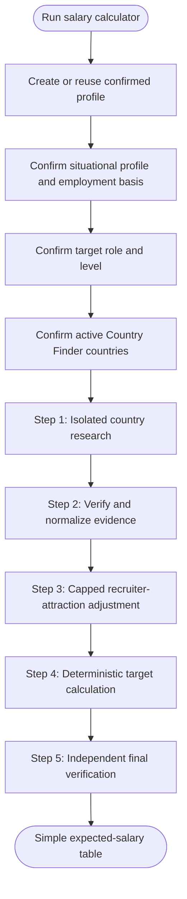

# /salary-calculator

Researches current salary evidence and returns one recruiter-friendly expected salary, one monthly equivalent, and one short interview range per selected country. Detailed evidence, adjustments, and calculations stay in workspace files.

## Usage

```
/claude-compass:salary-calculator
```

## Flow


```mermaid
flowchart TD
  Start([Run salary calculator]) --> Profile[Create or reuse confirmed profile]
  Profile --> Situation[Confirm situational profile and employment basis]
  Situation --> Level[Confirm target role and level]
  Level --> Countries[Confirm active Country Finder countries]
  Countries --> Research[Step 1: Isolated country research]
  Research --> Validate[Step 2: Verify and normalize evidence]
  Validate --> Adjust[Step 3: Capped recruiter-attraction adjustment]
  Adjust --> Calculate[Step 4: Deterministic target calculation]
  Calculate --> Audit[Step 5: Independent final verification]
  Audit --> Done([Simple expected-salary table])
```

## Preflight

Before research begins, Claude confirms:

- candidate identity and resume profile,
- current location, citizenship, work authorization, languages, age, and salary floor,
- whether salaries are for relocation, cross-border remote work, or Country Finder's selected path,
- target role and career level.

The pipeline will not blend local-relocation compensation and cross-border remote compensation into one number.

## Steps

### [Step 1: Salary research](salary-calculator/step1-research-prompt-generator.html)

Uses Country Finder's active-application countries as the default list, with the Gold or top-priority group preferred. After confirmation, each country is researched independently. The research produces one broad-market Low, Realistic midpoint, and Strong salary band plus a candidate-specific sponsorship threshold record.

### [Step 2: Evidence validation](salary-calculator/step2-data-validation.html)

Opens the decisive sources, checks role, level, location, currency, compensation basis, dates, and numerical consistency, then repairs incomplete evidence where possible. Each country receives an evidence grade.

### [Step 3: Recruiter-attraction adjustment](salary-calculator/step3-international-adjustment.html)

Applies a deliberate 0 to 12 percent adjustment to the verified midpoint when concrete overseas-hiring friction makes a slightly lower initial ask strategically useful. It does not use passport rankings or presumed nationality prestige.

### [Step 4: Target calculation](salary-calculator/step4-table-calculation.html)

Calculates one Expected Salary per country. The target cannot fall below the verified market low, an applicable legal sponsorship threshold, or a user-declared hard floor. It also generates a monthly equivalent and a short evidence-based interview range.

### [Step 5: Final verification](salary-calculator/step5b-final-verification.html)

Independently checks sources, adjustment logic, immigration rules, arithmetic, and rounding. Corrections require evidence or a deterministic calculation error. The final compact table is shown in chat and saved with the detailed audit.

## Final table

| Country | Visa Minimum | Expected Annual | Expected Monthly | Interview Range Annual |
|---|---:|---:|---:|---:|

- Expected Annual is the single number for application forms.
- Expected Monthly is its monthly equivalent.
- Interview Range is the short answer for recruiter or interview conversations.
- Detailed employer scenarios stay out of the final table.

## Resume behavior

State schema version 2 records candidate and input fingerprints plus completed country research. If the candidate, role, country list, or employment basis changes, Claude restarts from the earliest affected step instead of silently reusing stale data.
