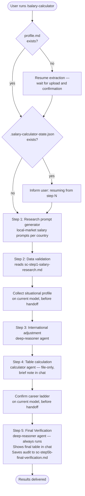

# /salary-calculator

Runs the full Salary Calculator pipeline. Generates ready-to-copy research prompts for local-market salary data, ingests your research results, applies an international candidate adjustment, produces a salary table with shown calculations, and audits it with a mandatory final verification. Runs standalone after Country Finder. Resumes from the last completed step if interrupted.

## Usage

```
/claude-compass:salary-calculator
```

Run it once per session. Claude resumes automatically if a `.salary-calculator-state.json` file already exists.

## Flow


```mermaid
flowchart TD
  Start([User runs /salary-calculator]) --> Profile{profile.md\nexists?}
  Profile -->|no| Extract[Resume extraction —\nwait for upload and confirmation]
  Profile -->|yes| State
  Extract --> State

  State{.salary-calculator-state.json\nexists?} -->|yes| Resume[Inform user: resuming from step N]
  State -->|no| S1
  Resume --> S1

  S1[Step 1: Research prompt generator\nlocal-market salary prompts per country] --> S2
  S2[Step 2: Data validation\nreads sc-step1-salary-research.md] --> S3prep
  S3prep[Collect situational profile\non current model, before handoff] --> S3
  S3[Step 3: International adjustment\ndeep-reasoner agent] --> S4
  S4[Step 4: Table calculation\ncalculator agent — file-only,\nbrief note in chat] --> Ladder

  Ladder[Confirm career ladder\non current model, before handoff] --> S5[Step 5: Final Verification\ndeep-reasoner agent — always runs\nShows final table in chat\nSaves audit to sc-step5b-final-verification.md]
  S5 --> Done([Results delivered])
```

## Steps

### Profile check

Checks for `profile.md` in the workspace. If absent, reads `prompts/shared/resume-extraction-prompt.md`, waits for the user to upload their resume, and waits for explicit confirmation of the extracted profile. The profile is reused on all subsequent runs without re-extraction.

### State check

Checks for `.salary-calculator-state.json`. If found, reads `last_completed_step` and informs the user which step will resume. If absent, creates the file with `last_completed_step: 0` and starts from Step 1. Updates the file after each step completes.

### [Step 1 — Research prompt generator](salary-calculator/step1-research-prompt-generator.html)

If Country Finder's output exists (`cf-step6-final-ranking.md` or `cf-step5-scoring-results.md`), offers its Strong/Moderate-fit countries as a starting point before asking. Generates ready-to-copy research prompts for each target country, scoped to the candidate's role and profile from `profile.md`. Each prompt instructs the researcher to find realistic local-market annual base salary ranges — excluding expat, FAANG-only, US-skewed, contractor, and equity-heavy data. Prompts request two company tiers (mid-size local-market and premium/international), city-level breakdowns where relevant, sourced, dated evidence, and each country's sponsorship salary threshold for employer-sponsored work-visa relocation, if one exists.

### [Step 2 — Data validation](salary-calculator/step2-data-validation.html)

Reads `sc-step1-salary-research.md` written by Step 1 and stores each country's data automatically — no pasting. Validates each block: one country per block, both company tiers and sources present, duplicates skipped and noted. Data is preserved verbatim — no analysis or adjustments during ingestion. Stored data is written to `sc-step2-salary-data.md` for later steps.

### [Step 3 — International adjustment](salary-calculator/step3-international-adjustment.html)

Before this step, the command collects the situational profile on your current model (so it exists before any Opus handoff). Claude then asks whether to use the **deep-reasoner** subagent (Opus, high effort) for higher reasoning accuracy — if declined, the step runs with your current model. Estimates the international candidate adjustment for each country — the realistic hiring discount an overseas applicant may face compared to a local candidate, based on employer risk perception, visa complexity, remote interview logistics, and local talent availability. Shows reasoning for each adjustment.

### [Step 4 — Table calculation](salary-calculator/step4-table-calculation.html)

Claude asks whether to use the **calculator** subagent (Opus, max effort) for higher arithmetic precision — if declined, the step runs with your current model. Reads all ingested salary data and adjustment figures, works through full arithmetic for every country, and double-checks each calculation before finalising. Precision takes priority over speed. Countries with a reported sponsorship salary threshold get a Legal Requirement column flagging whether Safe or Stretch falls short — the figures themselves are never adjusted to meet it. This is the raw, pre-audit calculation — the shown work and table are saved to file only, with just a brief scored/skipped count in chat, since Step 5 always runs next and is where the actual final table is presented.

### [Step 5 — Final Verification](salary-calculator/step5b-final-verification.html)

Always runs after Step 4 completes — this is the only step in the pipeline with no skip option, since it produces the final result. It first drafts your career ladder on the current model and waits for your confirmation (saved to `sc-step5a-career-ladder.md`) before any Opus handoff, then asks whether to use the **deep-reasoner** subagent (Opus, high effort) — if declined, the step runs with your current model. Audits the table output for inconsistencies, outliers, or weak evidence, and revises it if the evidence supports doing so. Since Step 4's output is file-only, this step always shows the final table directly in chat — whether that's the unchanged Step 4 table or a revised one — making it the one point in the pipeline where you actually see the numbers.

## Stop conditions

- **Profile not yet uploaded.** Claude waits — it does not proceed or fill in placeholder data.
- **Any step instructs Claude to wait.** Claude stops and waits. No guessing, no assumptions.
- **Data validation receives multiple countries or missing required tiers/sources.** Claude never stops mid-batch — it skips the item and records the reason. Duplicates and skipped items are all reported together in one consolidated report at the end of Step 2, rather than stopping the run.

## See also

- [`/country-finder`](country-finder.html) — discover which countries are worth calculating salaries for
- [`/portal-finder`](portal-finder.html) — find verified job portals for a specific country
- [`/job-screener`](job-screener.html) — screen job descriptions against your resume profile
