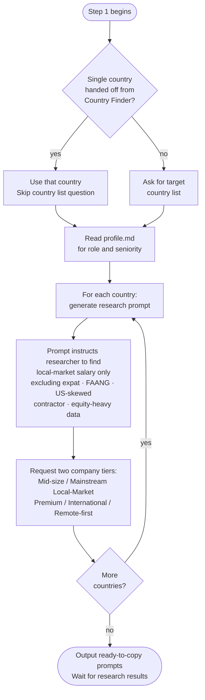

# Step 1 — Research prompt generator

Generates one ready-to-copy research prompt per target country, scoped to your role and profile. Claude does not estimate salaries itself — every number must come from research you supply.

## Flow

## What it reads

- `profile.md` — used to fill in your target role, seniority, and skills in each prompt
- `target_country` from the state file — if set by a Country Finder handoff, the country list question is skipped

## Country list

If invoked standalone (not handed off from Country Finder), Claude asks for your target country list before generating any prompts.

If invoked with a single country handed off from Country Finder, that country is used directly and the question is skipped.

## Prompt content

Each generated prompt instructs the researcher to:

- Use current web research only, prioritising sources from the last 12 months
- Find realistic local-market annual base salary for your role and seniority
- Target local candidates with a similar profile — not expat, FAANG-only, or global remote rates
- Separate results into two company tiers:
  - **Mid-size / Mainstream Local-Market** — typical local employers
  - **Premium / International / Remote-first** — higher-paying segment
- Provide a national range and major tech hub range if salary varies significantly by city
- Include practical Low, Realistic, and Strong figures within each tier
- Cite sources with dates

**Excluded from research:**
- levels.fyi and FAANG-only data
- Glassdoor US or US-skewed compensation
- Inflated global or remote compensation
- Contractor or freelance rates
- Equity-heavy total compensation

## Output

One ready-to-copy research prompt per country, clearly separated by country name. Claude waits for you to run the research and paste results back in Step 2.
