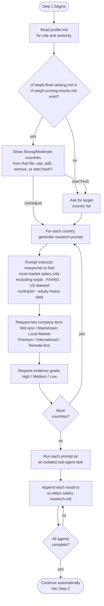

# Step 1: Research prompt generator

Generates one ready-to-copy research prompt per target country, runs each as an isolated sub-agent research task, and saves the results to `sc-step1-salary-research.md`. Claude does not estimate salaries itself; every number comes from real web research.

## Flow

```mermaid
flowchart TD
  Start([Step 1 begins]) --> ReadProfile[Read profile.md\nfor role and seniority]
  ReadProfile --> CFCheck{cf-step6-final-ranking.md or\ncf-step5-scoring-results.md exist?}
  CFCheck -->|yes| Offer[Show Strong/Moderate countries\nfrom that file: use, add, remove, or start fresh?]
  CFCheck -->|no| AskList[Ask for target\ncountry list]
  Offer -->|start fresh| AskList
  Offer -->|use/adjust| ForEach
  AskList --> ForEach[For each country:\ngenerate research prompt]
  ForEach --> Prompt[Prompt instructs researcher to find\nlocal-market salary only\nexcluding expat · FAANG · US-skewed\ncontractor · equity-heavy data]
  Prompt --> Tiers[Request two company tiers:\nMid-size / Mainstream Local-Market\nPremium / International / Remote-first]
  Tiers --> Grade[Request evidence grade:\nHigh / Medium / Low]
  Grade --> More{More\ncountries?}
  More -->|yes| ForEach
  More -->|no| Agents[Run each prompt as\nan isolated sub-agent task]
  Agents --> Append[Append each result to\nsc-step1-salary-research.md]
  Append --> AllDone{All agents\ncomplete?}
  AllDone -->|no| Append
  AllDone -->|yes| Done([Continue automatically\ninto Step 2])
```

## What it reads

- `profile.md`: used to fill in your target role, seniority, and skills in each prompt
- `cf-step6-final-ranking.md` or `cf-step5-scoring-results.md`, if either exists; see Country list below

## Country list

Before asking cold, Claude checks for Country Finder's output: `cf-step6-final-ranking.md` if it exists (preferred, since it's the post-audit result), otherwise `cf-step5-scoring-results.md`. If either is found, Claude extracts every country classified Strong or Moderate fit on any track and shows you that list, asking whether to use it as-is, add to it, remove countries, or start fresh. If neither file exists, or you choose to start fresh, Claude asks for your target country list directly.

## Prompt content

Each generated prompt instructs the researcher to:

- Use current web research only, prioritising sources from the last 12 months
- Find realistic local-market annual base salary for your role and seniority
- Target local candidates with a similar profile, not expat, FAANG-only, or global remote rates
- Separate results into two company tiers:
  - **Mid-size / Mainstream Local-Market**: typical local employers
  - **Premium / International / Remote-first**: higher-paying segment
- Provide a national range and major tech hub range if salary varies significantly by city
- Include practical Low, Realistic, and Strong figures within each tier
- Cite sources with dates
- Report the country's government-mandated minimum salary threshold for employer-sponsored work-visa relocation as one of five states (see `skills/sponsorship-threshold-rules.md`): a verified figure, "no fixed threshold," "not applicable" (most remote and contractor arrangements), "unknown" if a plausible route exists but the figure couldn't be confirmed, or "blocked" if a real route exists but is currently unavailable to this candidate (e.g. exhausted quota, paused category, an eligibility cutoff), with the concrete reason stated
- Self-assess an evidence grade (High / Medium / Low) based on source count and consistency

**Excluded from research:**
- levels.fyi and FAANG-only data
- Glassdoor US or US-skewed compensation
- Inflated global or remote compensation
- Contractor or freelance rates
- Equity-heavy total compensation

## Sub-agent isolation

Each country's prompt is run as a separate, isolated research task. Each agent receives only one country's prompt and must not produce or save results for any other country. If isolation cannot be guaranteed, Claude shows the prompts and waits for you to bring back results manually before continuing.

## Output

Results are appended to `sc-step1-salary-research.md` in the workspace as each agent completes. Step 2 reads this file automatically. Claude does not reproduce the per-country research findings in chat; only a brief summary (how many countries were researched) and confirmation that the file is saved.

## Stop condition

Claude stops and waits at two points: the country-list question (if Country Finder's output exists or none was given cold) and the manual-research fallback (if isolated sub-agents aren't available). Otherwise, once all results are saved, Claude continues automatically into Step 2 within the same response, without waiting for a new message.
