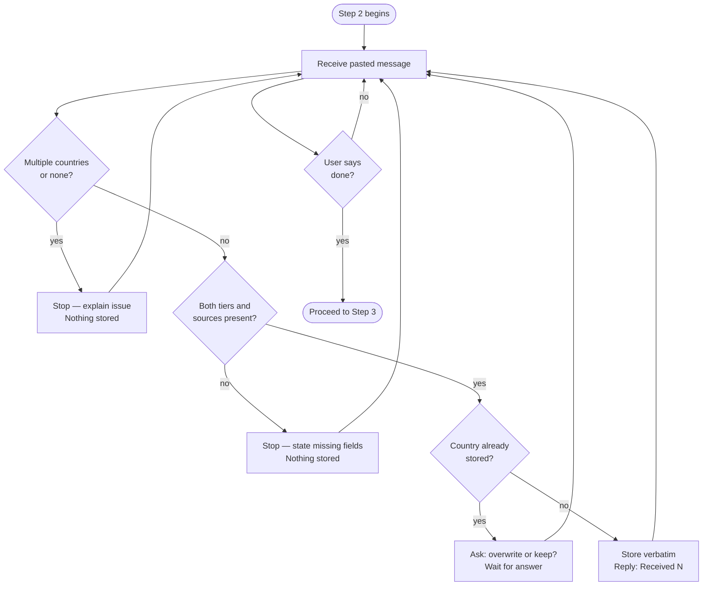

# Step 2 — Data ingestion

A strict silent-storage mode. Claude reads and stores salary research you paste in, one country at a time, with no analysis until you explicitly request it.

## Flow

## What it reads

- Candidate country list from Step 1 (used to validate incoming data)

## Rules

Every rule below applies to every message received in this step:

| Situation | Claude's response |
|---|---|
| Valid, complete data for one country | `Received: N` (running count only, no names) |
| Message contains multiple countries | Stops and explains — nothing stored |
| Message contains no recognizable country | Stops and explains — nothing stored |
| Missing tier or sources | States exactly what is missing — nothing stored |
| Country already stored | Asks whether to overwrite or keep original — waits for answer |

Claude preserves all values, wording, and formatting exactly as provided. It does not correct, improve, or reinterpret the data.

## Required data per country

Each pasted entry must include both tiers:

- **Mid-size / Mainstream Local-Market tier** — Low, Realistic, Strong figures, city used if applicable, sources with dates
- **Premium / International / Remote-first tier** — Low, Realistic, Strong figures, city used if applicable, sources with dates

If either tier or its sources are missing, Claude stops and states what is missing before storing anything.

## Progress check

Type `list countries` at any point and Claude replies with the country names stored so far. No other data is shown.

## Moving to Step 3

Tell Claude you are done pasting data and want to proceed to the international adjustment.
