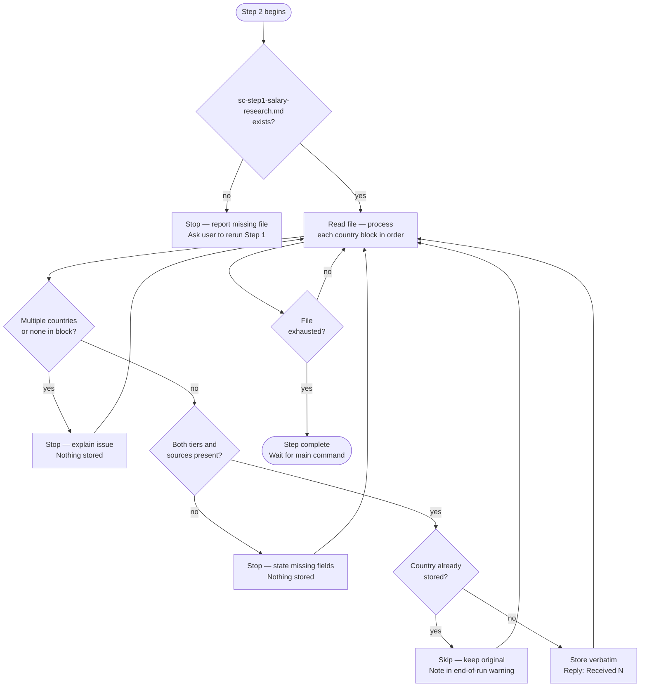

# Step 2 — Data ingestion

A strict silent-storage mode. Claude reads `sc-step1-salary-research.md` written by Step 1 and processes each country's data automatically — no pasting required. If the file is missing, Claude stops and reports it rather than waiting for manual input.

## Flow

```mermaid
flowchart TD
  Start([Step 2 begins]) --> FileCheck{sc-step1-salary-research.md\nexists?}
  FileCheck -->|no| Error[Stop — report missing file\nAsk user to rerun Step 1]
  FileCheck -->|yes| ReadFile[Read file — process\neach country block in order]
  ReadFile --> MultiCheck{Multiple countries\nor none in block?}
  MultiCheck -->|yes| Err1[Stop — explain issue\nNothing stored]
  Err1 --> ReadFile
  MultiCheck -->|no| FieldCheck{Both tiers and\nsources present?}
  FieldCheck -->|no| Err2[Stop — state missing fields\nNothing stored]
  Err2 --> ReadFile
  FieldCheck -->|yes| DupCheck{Country already\nstored?}
  DupCheck -->|yes| Skip[Skip — keep original\nNote in end-of-run warning]
  DupCheck -->|no| Store[Store verbatim\nReply: Received N]
  Skip --> ReadFile
  Store --> ReadFile
  ReadFile --> Done{File\nexhausted?}
  Done -->|no| ReadFile
  Done -->|yes| End([Step complete\nWait for main command])
```

## What it reads

- `sc-step1-salary-research.md` — written by Step 1 sub-agents

## Rules

| Situation | Claude's response |
|---|---|
| Valid, complete data for one country | `Received: N` (running count only, no names) |
| File not found | Stops — reports missing file, asks user to ensure Step 1 completed |
| Block contains multiple countries | Stops and explains — nothing stored |
| Block contains no recognizable country | Stops and explains — nothing stored |
| Missing tier or sources | States exactly what is missing — nothing stored |
| Country already stored | Skips it, keeps original, notes it in a warning after processing |

Claude preserves all values, wording, and formatting exactly as provided. It does not correct, improve, or reinterpret the data.

## Required data per country

Each block must include both tiers:

- **Mid-size / Mainstream Local-Market tier** — Low, Realistic, Strong figures, city used if applicable, sources with dates
- **Premium / International / Remote-first tier** — Low, Realistic, Strong figures, city used if applicable, sources with dates

If either tier or its sources are missing, Claude stops and states what is missing before storing anything.

## Output

Stored salary data is written to `sc-step2-salary-data.md` in the workspace after all blocks are processed. Step 3 and Step 4 read from this file directly.

## Stop condition

Once all countries from `sc-step1-salary-research.md` have been processed, Claude stops and waits for the main command. Any skipped duplicates are reported in a warning before stopping.
