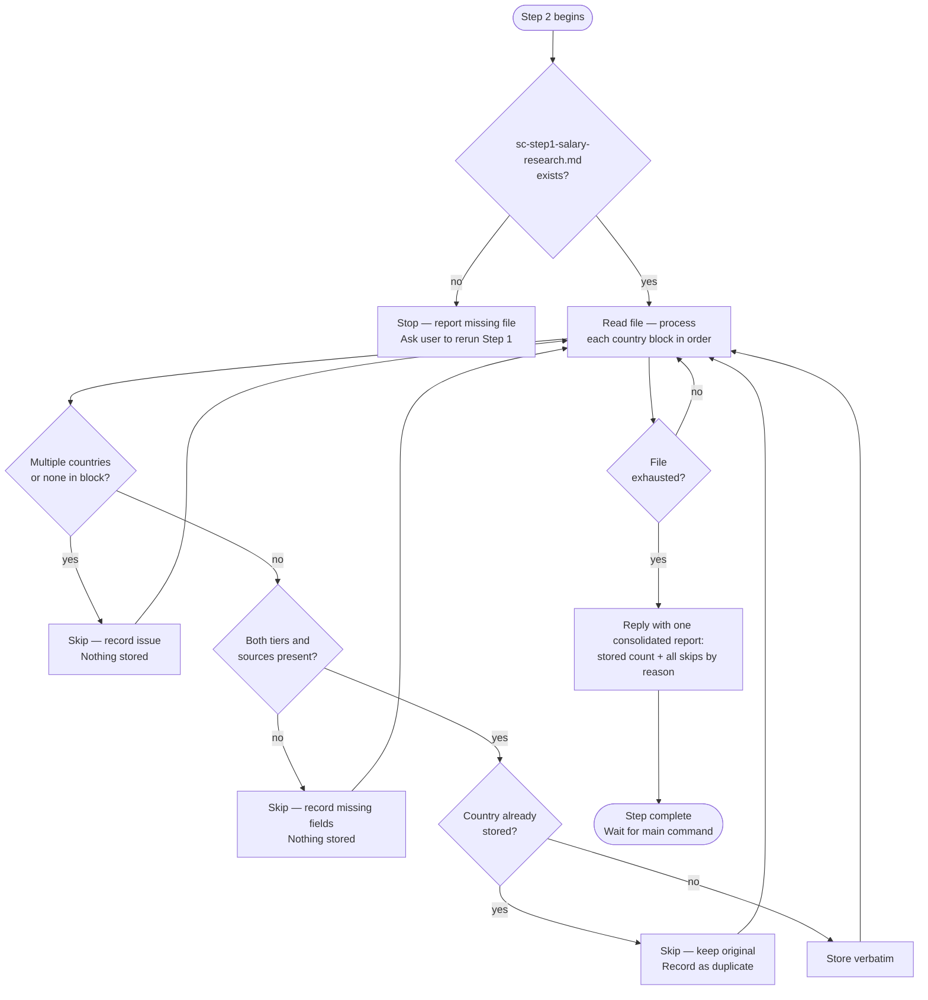

# Step 2 — Data validation

A strict silent-storage mode. Claude reads `sc-step1-salary-research.md` written by Step 1 and processes each country's data automatically — no pasting required. If the file is missing, Claude stops and reports it rather than waiting for manual input.

## Flow

## What it reads

- `sc-step1-salary-research.md` — written by Step 1 sub-agents

## Rules

This runs fully automated, with no pause between countries — bad items are skipped and recorded, never halted on.

| Situation | Claude's response |
|---|---|
| File not found | Stops — reports missing file, asks user to ensure Step 1 completed |
| Block contains multiple countries | Skips it and records the issue — nothing stored |
| Block contains no recognizable country | Skips it and records the issue — nothing stored |
| Missing tier or sources | Skips it and records what's missing — nothing stored |
| Country already stored | Skips it, keeps original, records it as a duplicate |
| Valid, complete data for one country | Stored silently |

Claude preserves all values, wording, and formatting exactly as provided. It does not correct, improve, or reinterpret the data.

## Required data per country

Each block must include both tiers:

- **Mid-size / Mainstream Local-Market tier** — Low, Realistic, Strong figures, city used if applicable, sources with dates
- **Premium / International / Remote-first tier** — Low, Realistic, Strong figures, city used if applicable, sources with dates

If either tier or its sources are missing, Claude skips that country and records what is missing — nothing is stored, and the run continues to the next country.

## Output

Stored salary data is written to `sc-step2-salary-data.md` in the workspace after all blocks are processed. Step 3 and Step 4 read from this file directly.

## Stop condition

Once all countries from `sc-step1-salary-research.md` have been processed, Claude writes all successfully stored countries to `sc-step2-salary-data.md`, replies with one consolidated report (stored count, plus every skip grouped by reason — malformed, missing tier or sources, duplicate), then stops and waits for the main command.
