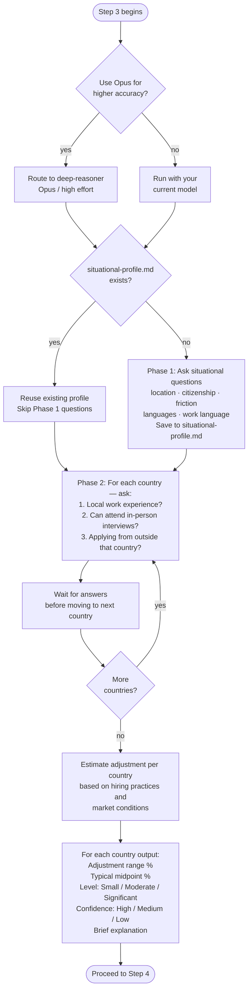

# Step 3 — International adjustment

Estimates the realistic hiring discount an overseas candidate may face when negotiating with local employers, compared to a local candidate at the same level. Before running, Claude asks whether to use the **deep-reasoner** subagent (Opus, high effort) for higher reasoning accuracy. If you decline, the step runs with your current model.

## Flow

## What it reads

- All salary data stored in Step 2
- `situational-profile.md` — if present, Phase 1 questions are skipped
- Your per-country answers from Phase 2

## Phase 1 — Situational questions (once, if not already saved)

If `situational-profile.md` does not exist, Claude asks:

1. Current location
2. Citizenship
3. Any known immigration friction or employer risk perception tied to your citizenship
4. Languages spoken
5. Required work environment language

Answers are saved to `situational-profile.md` and reused across sessions.

## Phase 2 — Per-country questions

For each country in the salary dataset, Claude asks three questions and waits for your answers before moving to the next country:

1. Do you have local work experience in this country?
2. Can you attend in-person interviews or onsite meetings for roles there?
3. Are you applying from outside that country?

## What the adjustment estimates

The adjustment reflects practical recruiter and employer behaviour for overseas candidates, not a legal pay rule. Factors considered:

- Openness to international hiring in that market
- Employer willingness to sponsor overseas candidates
- Visa complexity and processing friction
- Local talent availability and competition
- Language tolerance in the workplace
- Relocation friction and remote interview logistics
- Perceived hiring risk for overseas applicants
- Current hiring market conditions (last 12 months)

This is not about tax, cost of living, purchasing power, or permanent residence pathways.

## Output per country

- Adjustment range (%)
- Typical midpoint adjustment (%)
- Adjustment level: Small, Moderate, or Significant
- Confidence: High, Medium, or Low
- Brief explanation
