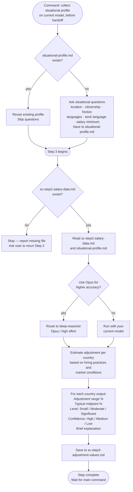

# Step 3 — International adjustment

Estimates the realistic hiring discount an overseas candidate may face when negotiating with local employers, compared to a local candidate at the same level. Before running, the main command collects the situational profile (on your current model), then asks whether to use the **deep-reasoner** subagent (Opus, high effort) for higher reasoning accuracy. If you decline, the step runs with your current model.

## Flow

```mermaid
flowchart TD
  Start([Command: collect situational profile\non current model, before handoff]) --> SitCheck{situational-profile.md\nexists?}
  SitCheck -->|yes| ReuseSit[Reuse existing profile\nSkip questions]
  SitCheck -->|no| SitQ[Ask situational questions\nlocation · citizenship · friction\nlanguages · work language · salary minimum\nSave to situational-profile.md]
  ReuseSit --> Begin
  SitQ --> Begin
  Begin([Step 3 begins]) --> FileCheck{sc-step2-salary-data.md\nexists?}
  FileCheck -->|no| Error[Stop — report missing file\nAsk user to rerun Step 2]
  FileCheck -->|yes| ReadFile[Read sc-step2-salary-data.md\nand situational-profile.md]
  ReadFile --> OpusQ{Use Opus for\nhigher accuracy?}
  OpusQ -->|yes| DeepReasoner[Route to deep-reasoner\nOpus / high effort]
  OpusQ -->|no| CurrentModel[Run with your\ncurrent model]
  DeepReasoner --> Estimate
  CurrentModel --> Estimate
  Estimate[Estimate adjustment per country\nbased on hiring practices and\nmarket conditions] --> Output[For each country output:\nAdjustment range %\nTypical midpoint %\nLevel: Small / Moderate / Significant\nConfidence: High / Medium / Low\nBrief explanation]
  Output --> Save[Save to sc-step3-adjustment-values.md]
  Save --> Done([Step complete\nWait for main command])
```

## What it reads

- `sc-step2-salary-data.md` — salary data from Step 2
- `situational-profile.md` — collected by the main command before this step, so it always exists here

## Situational questions (collected before the step, once, if not already saved)

The main command collects these on your current model before any Opus handoff, so the subagent path never has to ask interactively. If `situational-profile.md` does not exist, Claude asks:

1. Current location
2. Citizenship
3. Any known immigration friction or employer risk perception tied to your citizenship
4. Languages spoken
5. Required work environment language
6. Minimum acceptable monthly salary and currency — or "not specified" to skip salary filtering

Answers are saved to `situational-profile.md` and reused across sessions and pipelines.

## What the adjustment estimates

The adjustment reflects practical recruiter and employer behaviour for overseas candidates, not a legal pay rule. Factors considered:

- Openness to international hiring in that market
- Employer willingness to sponsor overseas candidates
- Visa complexity and processing friction
- Local talent availability and competition
- Language tolerance in the workplace
- Relocation friction and remote interview logistics
- Perceived hiring risk for overseas applicants
- Current hiring market conditions (last 12 months)

This is not about tax, cost of living, purchasing power, or permanent residence pathways.

## Output per country

- Adjustment range (%)
- Typical midpoint adjustment (%)
- Adjustment level: Small, Moderate, or Significant
- Confidence: High, Medium, or Low
- Brief explanation

Results are saved to `sc-step3-adjustment-values.md` in the workspace. Step 4 reads this file directly.
