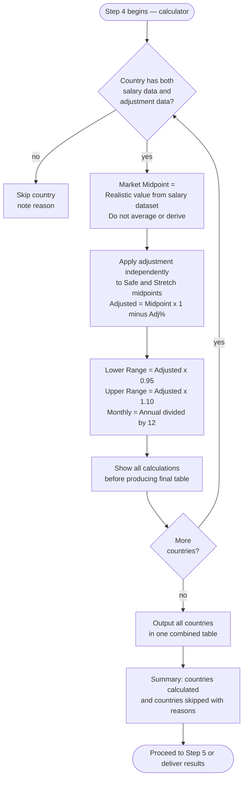

# Step 4 — Final table calculation

Applies the international adjustment to the salary data and produces a final table with shown calculations. Routed to the **calculator** subagent (Opus, max effort). Precision takes priority over speed.

## Flow



## What it reads

- All salary data stored in Step 2
- All adjustment figures from Step 3

## Definitions

| Term | Definition |
|---|---|
| **Market Midpoint** | The "Realistic" value for the relevant tier from the salary dataset. Never averaged or estimated. |
| **Safe** | Market Midpoint from the Mid-size / Mainstream Local-Market tier |
| **Stretch** | Market Midpoint from the Premium / International / Remote-first tier |

## Calculation rules

**Adjusted Midpoint:**
```
Adjusted Midpoint = Market Midpoint × (1 − Adjustment %)
```

**Range:**
```
Lower Range = Adjusted Midpoint × 0.95
Upper Range = Adjusted Midpoint × 1.10
```

**Monthly:**
```
Monthly = Annual ÷ 12
```

The adjustment is applied independently to both Safe and Stretch midpoints.

## Show your work

Before producing the final table, the calculator shows the full calculation for every country — Market Midpoint, Adjustment % applied, and resulting Adjusted Midpoint for both Safe and Stretch — so you can verify the arithmetic before the table is finalised.

## Output table format

One combined table covering all calculated countries:

| Country | Period | Safe (Range) | Safe (Fixed) | Stretch (Range) | Stretch (Fixed) |
|---|---|---|---|---|---|

- Country column includes the currency code, e.g. `Germany (EUR)`
- Each country has two rows: Annual and Monthly
- Values in local currency only — no USD conversion
- Annual rounded to nearest 500, Monthly to nearest 50
- No currency symbols inside salary values

Countries missing either salary data or adjustment data are skipped and listed in the summary with the reason.
