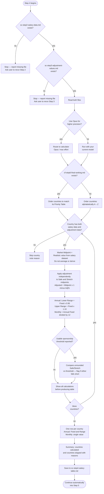

# Step 4 — Table calculation

Applies the international adjustment to the salary data and produces a table with shown calculations. Before running, Claude asks whether to use the **calculator** subagent (Opus, max effort) for higher arithmetic precision. If you decline, the step runs with your current model. Precision takes priority over speed.

## Flow



## What it reads

- `sc-step2-salary-data.md` — salary data from Step 2, including each country's sponsorship salary threshold if one was reported
- `sc-step3-adjustment-values.md` — adjustment figures from Step 3
- `skills/sponsorship-threshold-rules.md` — governs the Legal Requirement column below
- `cf-step6-final-ranking.md` — if present, its Priority Table order is used to order this step's output; if absent, countries are ordered alphabetically instead

## Definitions

| Term | Definition |
|---|---|
| **Market Midpoint** | The "Realistic" value for the relevant tier from the salary dataset. Never averaged or estimated. |
| **Safe** | Market Midpoint from the Mid-size / Mainstream Local-Market tier |
| **Stretch** | Market Midpoint from the Premium / International / Remote-first tier |

## Calculation rules

**Adjusted Midpoint (= Fixed):**
```
Adjusted Midpoint = Market Midpoint × (1 − Adjustment %)
```

**Range (Annual only):**
```
Lower Range = Annual Fixed × 0.95
Upper Range = Annual Fixed × 1.10
```

**Monthly (a single reference value, not a range):**
```
Monthly = Annual Fixed ÷ 12
```

Monthly values are a reference only and may not represent actual monthly payslips in countries using 13th or 14th salary payments. The adjustment is applied independently to both Safe and Stretch midpoints.

## Ordering

Countries are ordered to match `cf-step6-final-ranking.md`'s Priority Table if that file exists in the workspace; otherwise, alphabetically by country name (A→Z).

## Legal Requirement comparison

For any country with a usable sponsorship salary threshold, the unrounded Safe and Stretch Fixed values are compared against it — before display rounding is applied, since rounding could flip a borderline result. The threshold is converted to match whichever period (Annual or Monthly) the comparison needs. This never changes Safe or Stretch itself — it's a separate fact shown alongside them, not folded into the calculation. The resulting display states are detailed in Table format below.

## Show your work

Before producing the table, the calculator works through the full calculation for every country — Market Midpoint, Adjustment % applied, and resulting Adjusted Midpoint for both Safe and Stretch.

Countries missing either salary data or adjustment data are skipped and listed in the summary with the reason.

## Table format

One Markdown table with one row per country:

| Country | Legal Requirement | 🛡️ Safe Annual | 🚀 Stretch Annual | 🛡️ Safe Monthly | 🚀 Stretch Monthly |
|---|---:|---:|---:|---:|---:|
| 🇩🇪 Germany (EUR) | 45,300 (3,775/mo) | 59,500 (56,500–65,500) | 74,500 (71,000–82,000) | 4,950 | 6,200 |
| 🇳🇱 Netherlands (EUR) | 63,972 (5,331/mo) ⚠️ | 56,500 (53,500–62,000) | 70,000 (66,500–77,000) | 4,700 | 5,850 |
| 🇺🇸 United States (USD) | — | 140,000 (133,000–154,000) | 175,000 (166,500–192,500) | 11,650 | 14,600 |

- The country's flag emoji is placed before its name, and the currency code is included, e.g. `🇩🇪 Germany (EUR)`.
- Each Annual column shows the Fixed target first, then its Range in parentheses.
- Each Monthly column shows only the single Monthly value (Annual Fixed ÷ 12) — no range. Monthly values are a reference only and may not represent actual monthly payslips in countries using 13th or 14th salary payments.
- Values in local currency only — no USD conversion.
- Annual (Fixed and Range) rounded to nearest 500, Monthly to nearest 50.
- No currency symbols inside salary values.
- Legal Requirement, Safe Annual, Stretch Annual, Safe Monthly, and Stretch Monthly are right-aligned.
- No footnotes, revision markers, notes, explanations, or additional columns.

**Legal Requirement column:**

| State | Shown as |
|---|---|
| No usable threshold (none exists, or couldn't be confirmed as a comparable number) | — (em dash) |
| Threshold exists, both Safe and Stretch clear it | Both period equivalents in one cell — Annual figure first, Monthly in parentheses with a "/mo" suffix, e.g. `45,300 (3,775/mo)`. Neither figure is rounded. |
| Threshold exists, either Safe or Stretch falls short | Same combined format, with a single ⚠️ appended once at the end of the cell |

Safe and Stretch are never adjusted because of this column — it's shown alongside them as a separate fact, not merged into the calculation.

If Step 5 recalibrates, its revised table reuses this exact format and column order — see [Step 5 — Final Verification](step5b-final-verification.html).

## Output

- `sc-step4-salary-table.md` — the raw, pre-audit table and summary, written for Step 5 to read. This step's own output is file-only, unlike Step 5, which does show its resulting table in chat.

Claude does not reproduce the calculations or the table in chat — instead, it tells you in a few lines how many countries were calculated and skipped, and confirms the file is saved.

## Stop condition

There is no interactive checkpoint in this step. Once results are saved, Claude continues automatically into Step 5 (final verification) within the same response, without waiting for a new message — it always runs and is never asked about.
