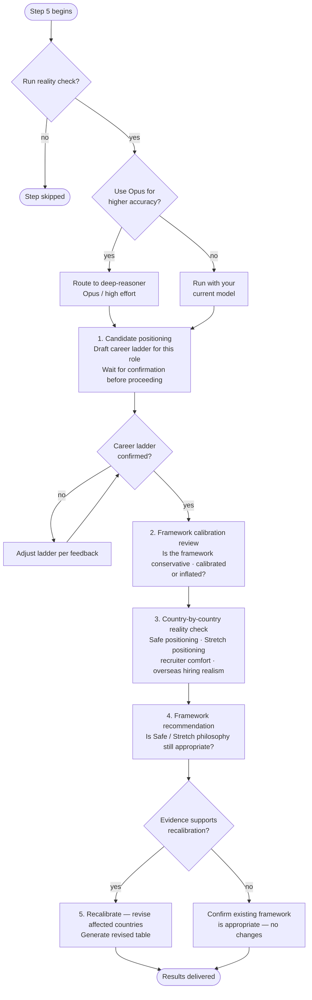

# Step 5 — Reality check (optional)

An independent audit of the final salary table from Step 4. Claude asks before running — it only proceeds if you confirm. If you confirm, Claude then asks whether to use the **deep-reasoner** subagent (Opus, high effort) for higher reasoning accuracy. If you decline, the step runs with your current model.

## Flow

## What it reads

- All salary data, adjustment figures, and the final table from Steps 1 through 4
- `profile.md` — used to assess candidate positioning and career level

## The four checks

**1. Candidate positioning**

Claude drafts the realistic career ladder for your field (e.g. Mid, Senior, Lead, Staff, Principal) and determines your likely current level and target role level. It waits for your confirmation or edits before using the ladder in the analysis. Compensation is benchmarked against the target role, not the highest historical responsibility.

**2. Framework calibration review**

Assesses whether the overall salary framework is conservative, recruiter-safe, appropriately calibrated, slightly inflated, or heavily inflated.

Evaluates legitimate compensation drivers (experience, technical depth, leadership scope, business impact, domain expertise) separately from potential inflation sources (premium employer weighting, multinational bias, niche specialist premium, higher-level title interpretation, AI optimism bias).

**3. Country-by-country reality check**

For each country, evaluates:

- Safe positioning — percentile band and classification (conservative to top-tier)
- Stretch positioning — classification (realistic stretch to international remote premium)
- Recruiter comfort — how likely is this to convert interviews?
- Sponsorship realism — does the number work for visa threshold purposes?
- Overseas hiring realism — adjusted for your profile as an international candidate

Uses approximate percentile bands (50–60%, 60–70%, etc.) — no false precision.

**4. Framework recommendation**

Determines whether the Safe/Stretch philosophy, employer segmentation, and percentile assumptions remain appropriate. If improvements are recommended, explains what assumption caused the issue and what structural change is recommended.

## Recalibration

Only if the evidence genuinely supports it:
- Affected countries are revised upward or downward
- A revised table is generated using the same format as Step 4
- Priority is given to recruiter comfort, interview conversion, sponsorship realism, and realistic overseas positioning

If recalibration is not supported, the existing framework is explicitly confirmed as appropriate and no revised table is generated.
