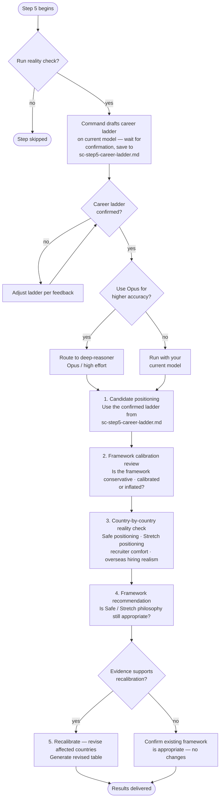

# Step 5 — Reality check (optional)

An independent audit of the final salary table from Step 4. Claude asks before running — it only proceeds if you confirm. If you confirm, Claude then asks whether to use the **deep-reasoner** subagent (Opus, high effort) for higher reasoning accuracy. If you decline, the step runs with your current model.

## Flow

```mermaid
flowchart TD
  Start([Step 5 begins]) --> RunQ{Run reality check?}
  RunQ -->|no| Skip([Step skipped])
  RunQ -->|yes| Ladder[Command drafts career ladder\non current model — wait for\nconfirmation, save to\nsc-step5-career-ladder.md]
  Ladder --> Confirm{Career ladder\nconfirmed?}
  Confirm -->|no| EditLadder[Adjust ladder per feedback]
  EditLadder --> Confirm
  Confirm -->|yes| OpusQ{Use Opus for\nhigher accuracy?}
  OpusQ -->|yes| DeepReasoner[Route to deep-reasoner\nOpus / high effort]
  OpusQ -->|no| CurrentModel[Run with your\ncurrent model]
  DeepReasoner --> C1
  CurrentModel --> C1[1. Candidate positioning\nUse the confirmed ladder from\nsc-step5-career-ladder.md]
  C1 --> C2[2. Framework calibration review\nIs the framework conservative · calibrated\nor inflated?]
  C2 --> C3[3. Country-by-country reality check\nSafe positioning · Stretch positioning\nrecruiter comfort · overseas hiring realism]
  C3 --> C4[4. Framework recommendation\nIs Safe / Stretch philosophy still appropriate?]
  C4 --> Recal{Evidence supports\nrecalibration?}
  Recal -->|yes| Revise[5. Recalibrate — revise affected countries\nGenerate revised table]
  Recal -->|no| Confirm2[Confirm existing framework\nis appropriate — no changes]
  Revise --> Done([Results delivered])
  Confirm2 --> Done
```

## What it reads

- `sc-step4-salary-table.md` — the final salary table from Step 4
- `sc-step2-salary-data.md` and `sc-step3-adjustment-values.md` — the underlying salary data and adjustment values
- `profile.md` — used to assess candidate positioning and career level
- `sc-step5-career-ladder.md` — the career ladder drafted and confirmed with you before the step runs

All inputs come from workspace files, so the reality check is safe to route to the isolated deep-reasoner subagent. The career ladder is confirmed on your current model before any Opus handoff, so the subagent never has to pause for interactive confirmation.

## The four checks

**1. Candidate positioning**

The career ladder for your field is drafted from `profile.md` and confirmed with you by the main command *before* the step runs, then saved to `sc-step5-career-ladder.md`. It is inferred from your actual profession — any field, not assumed to be software or tech — using that field's real progression and title conventions (a software ladder might run Mid → Senior → Lead → Staff, a culinary one Commis → Chef de Partie → Sous Chef → Head Chef). The step uses that confirmed ladder to determine your likely current level and target role level. Compensation is benchmarked against the target role, not the highest historical responsibility.

**2. Framework calibration review**

Assesses whether the overall salary framework is conservative, recruiter-safe, appropriately calibrated, slightly inflated, or heavily inflated.

Evaluates legitimate compensation drivers (experience, technical depth, leadership scope, business impact, domain expertise) separately from potential inflation sources (premium employer weighting, multinational bias, niche specialist premium, higher-level title interpretation, AI optimism bias).

**3. Country-by-country reality check**

For each country, evaluates:

- Safe positioning — percentile band and classification (conservative to top-tier)
- Stretch positioning — classification (realistic stretch to international remote premium)
- Recruiter comfort — how likely is this to convert interviews?
- Sponsorship realism — does the number work for visa threshold purposes?
- Overseas hiring realism — adjusted for your profile as an international candidate

Uses approximate percentile bands (50–60%, 60–70%, etc.) — no false precision.

**4. Framework recommendation**

Determines whether the Safe/Stretch philosophy, employer segmentation, and percentile assumptions remain appropriate. If improvements are recommended, explains what assumption caused the issue and what structural change is recommended.

## Recalibration

Only if the evidence genuinely supports it:
- Affected countries are revised upward or downward
- A revised table is generated using the same format as Step 4
- Priority is given to recruiter comfort, interview conversion, sponsorship realism, and realistic overseas positioning

If recalibration is not supported, the existing framework is explicitly confirmed as appropriate and no revised table is generated.
