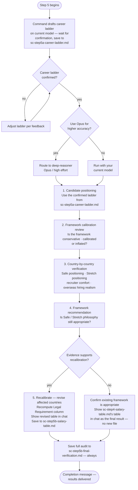

# Step 5 — Final Verification

An independent audit of the salary table from Step 4. Always runs — this is the only step in the pipeline with no skip option, since it produces the pipeline's final, human-facing result. Step 4's own output is file-only, so this is the one point where the actual salary numbers are shown to you. Claude asks whether to use the **deep-reasoner** subagent (Opus, high effort) for higher reasoning accuracy. If you decline, the step runs with your current model.

## Flow

## What it reads

- `sc-step4-salary-table.md` — the final salary table from Step 4
- `sc-step2-salary-data.md` and `sc-step3-adjustment-values.md` — the underlying salary data and adjustment values
- `profile.md` — used to assess candidate positioning and career level
- `sc-step5a-career-ladder.md` — the career ladder drafted and confirmed with you before the step runs

All inputs come from workspace files, so the audit is safe to route to the isolated deep-reasoner subagent. The career ladder is confirmed on your current model before any Opus handoff, so the subagent never has to pause for interactive confirmation.

All four checks below, the recalibration verdict, and the resulting final table (whether unchanged or revised) are shown directly in chat, not just saved to file — this is the pipeline's final step, so the audit itself, and the numbers it confirms, are the human-facing result.

## The four checks

**1. Candidate positioning**

The career ladder for your role is drafted from `profile.md` and confirmed with you by the main command *before* the step runs, then saved to `sc-step5a-career-ladder.md`. It assumes an IT/tech professional but is inferred from your actual role — any IT role, not assumed to be backend — using that role's real progression and title conventions (software engineering might run Mid → Senior → Staff → Principal, while data, DevOps, QA, security, product, or design each have their own ladder). The step uses that confirmed ladder to determine your likely current level and target role level. Compensation is benchmarked against the target role, not the highest historical responsibility.

**2. Framework calibration review**

Assesses whether the overall salary framework is conservative, recruiter-safe, appropriately calibrated, slightly inflated, or heavily inflated.

Evaluates legitimate compensation drivers (experience, technical depth, leadership scope, business impact, domain expertise) separately from potential inflation sources (premium employer weighting, multinational bias, niche specialist premium, higher-level title interpretation, AI optimism bias).

**3. Country-by-country verification**

For each country, evaluates:

- Safe positioning — percentile band and classification (conservative to top-tier)
- Stretch positioning — classification (realistic stretch to international remote premium)
- Recruiter comfort — how likely is this to convert interviews?
- Sponsorship realism — if Step 4 set a Legal Requirement flag for this country, that concrete result feeds into this judgment rather than being assessed independently of it
- Overseas hiring realism — adjusted for your profile as an international candidate

Uses approximate percentile bands (50–60%, 60–70%, etc.) — no false precision.

**4. Framework recommendation**

Determines whether the Safe/Stretch philosophy, employer segmentation, and percentile assumptions remain appropriate. If improvements are recommended, explains what assumption caused the issue and what structural change is recommended.

## Table format

Whether it's the unchanged table from Step 4 or a revised one, the table shown to you follows this format — one Markdown table with one row per country:

| Country | Legal Requirement | 🛡️ Safe Annual | 🚀 Stretch Annual | 🛡️ Safe Monthly | 🚀 Stretch Monthly |
|---|---:|---:|---:|---:|---:|
| 🇩🇪 Germany (EUR) | 45,300 (3,775/mo) | 59,500 (56,500–65,500) | 74,500 (71,000–82,000) | 4,950 | 6,200 |
| 🇳🇱 Netherlands (EUR) | 63,972 (5,331/mo) ⚠️ | 56,500 (53,500–62,000) | 70,000 (66,500–77,000) | 4,700 | 5,850 |
| 🇺🇸 United States (USD) | — | 140,000 (133,000–154,000) | 175,000 (166,500–192,500) | 11,650 | 14,600 |

- The country's flag emoji is placed before its name, and the currency code is included, e.g. `🇩🇪 Germany (EUR)`.
- Each Annual column shows the Fixed target first, then its Range in parentheses.
- Each Monthly column shows only the single Monthly value (Annual Fixed ÷ 12) — no range. Monthly values are a reference only and may not represent actual monthly payslips in countries using 13th or 14th salary payments.
- Values in local currency only — no USD conversion.
- Annual (Fixed and Range) rounded to nearest 500, Monthly to nearest 50.
- No currency symbols inside salary values.
- Legal Requirement, Safe Annual, Stretch Annual, Safe Monthly, and Stretch Monthly are right-aligned.
- No footnotes, revision markers, notes, explanations, or additional columns.
- Countries appear in the same order as Step 4's table (matching `cf-step6-final-ranking.md`'s Priority Table if it exists, otherwise alphabetical).

**Legal Requirement column:**

| State | Shown as |
|---|---|
| No usable threshold (none exists, or couldn't be confirmed as a comparable number) | — (em dash) |
| Threshold exists, both Safe and Stretch clear it | Both period equivalents in one cell — Annual figure first, Monthly in parentheses with a "/mo" suffix, e.g. `45,300 (3,775/mo)`. Neither figure is rounded. |
| Threshold exists, either Safe or Stretch falls short | Same combined format, with a single ⚠️ appended once at the end of the cell |

Safe and Stretch are never adjusted because of this column — it's shown alongside them as a separate fact, not merged into the calculation.

## Recalibration

Only if the evidence genuinely supports it:
- Affected countries are revised upward or downward
- A revised table is generated using the format above, **including the Legal Requirement column** — it is recomputed against the revised Safe and Stretch figures, not carried forward from Step 4. Recalibration can push a country below a threshold it previously cleared, or above one it previously missed.
- Priority is given to recruiter comfort, interview conversion, sponsorship realism, and realistic overseas positioning
- The revised table is shown directly in chat, then saved to `sc-step5b-salary-table.md` — this becomes the final table, superseding Step 4's. `sc-step4-salary-table.md` is left untouched as the pre-audit record.

If recalibration is not supported, the existing framework is explicitly confirmed as appropriate and no revised table is generated — but the table from `sc-step4-salary-table.md` is still shown directly in chat as the confirmed final result. No new file is created.

Regardless of whether recalibration happened, the full audit (all four checks plus the recalibration verdict) is always saved to `sc-step5b-final-verification.md` — this is the permanent record of the audit itself, distinct from whichever salary table ends up being final.

## Output

- `sc-step5b-final-verification.md` — always created; the full audit and recalibration verdict.
- Salary table: `sc-step4-salary-table.md` if no recalibration, or `sc-step5b-salary-table.md` if recalibrated (superseding Step 4's file).

Either way, Claude closes with a completion message confirming the pipeline is done and naming both files.

## Stop condition

Once the audit (and any recalibration) is complete and the completion message is shown, Claude stops and waits for the main command to deliver the final results — this is the last step in the pipeline.
