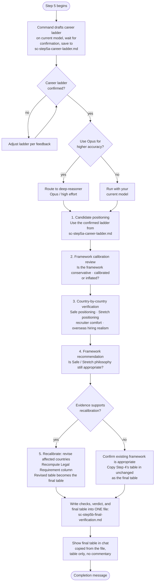

# Step 5: Final Verification

An independent audit of the salary table from Step 4. Always runs; this is the only step in the pipeline with no skip option, since it produces the pipeline's final result. The four detailed checks are file-only, like Step 4's own work, but the resulting final table is the one thing this step does show you, copied from the file into chat, table only with no surrounding commentary. Whether recalibration happened is stated as a plain fact in the completion message afterward, not as commentary attached to the table. Everything (checks, verdict, and table) is written to a single file, `sc-step5b-final-verification.md`; this step never creates more than one file. Claude asks whether to use the **deep-reasoner** subagent (Opus, high effort) for higher reasoning accuracy. If you decline, the step runs with your current model.

## Flow

## What it reads

- `sc-step4-salary-table.md`: the final salary table from Step 4
- `sc-step2-salary-data.md` and `sc-step3-adjustment-values.md`: the underlying salary data and adjustment values
- `profile.md`: used to assess candidate positioning and career level
- `sc-step5a-career-ladder.md`: the career ladder drafted and confirmed with you before the step runs

All inputs come from workspace files, so the audit is safe to route to the isolated deep-reasoner subagent. The career ladder is confirmed on your current model before any Opus handoff, so the subagent never has to pause for interactive confirmation.

All four checks and the recalibration verdict are saved to file only; not reproduced in chat, since the raw reasoning would overwhelm rather than help. The resulting final table (whether unchanged or revised) is written into that same file, then also shown directly in chat, copied from what was just saved, table only, no surrounding commentary.

## The four checks

_(File-only, written to `sc-step5b-final-verification.md`, not shown in chat. The final table further down is the exception.)_

**1. Candidate positioning**

The career ladder for your role is drafted from `profile.md` and confirmed with you by the main command *before* the step runs, then saved to `sc-step5a-career-ladder.md`. It assumes an IT/tech professional but is inferred from your actual role (any IT role, not assumed to be backend) using that role's real progression and title conventions (software engineering might run Mid → Senior → Staff → Principal, while data, DevOps, QA, security, product, or design each have their own ladder). The step uses that confirmed ladder to determine your likely current level and target role level. Compensation is benchmarked against the target role, not the highest historical responsibility.

**2. Framework calibration review**

Assesses whether the overall salary framework is conservative, recruiter-safe, appropriately calibrated, slightly inflated, or heavily inflated.

Evaluates legitimate compensation drivers (experience, technical depth, leadership scope, business impact, domain expertise) separately from potential inflation sources (premium employer weighting, multinational bias, niche specialist premium, higher-level title interpretation, AI optimism bias).

**3. Country-by-country verification**

For each country, evaluates:

- Safe positioning: percentile band and classification (conservative to top-tier)
- Stretch positioning: classification (realistic stretch to international remote premium)
- Recruiter comfort: how likely is this to convert interviews?
- Sponsorship realism: if Step 4 set a Legal Requirement flag for this country, that concrete result feeds into this judgment rather than being assessed independently of it; a "Blocked" state means sponsorship realism is zero for that country regardless of how attractive the salary figures look
- Overseas hiring realism: adjusted for your profile as an international candidate
- Evidence grade: a Low grade from Step 2 tempers how confidently this country's positioning is stated, even if the classification itself doesn't change

Uses approximate percentile bands (50–60%, 60–70%, etc.), no false precision.

**4. Framework recommendation**

Determines whether the Safe/Stretch philosophy, employer segmentation, and percentile assumptions remain appropriate. If improvements are recommended, explains what assumption caused the issue and what structural change is recommended.

## Recalibration

Only if the evidence genuinely supports it:
- Affected countries are revised upward or downward
- A revised table is generated using the same format as [Step 4](step4-table-calculation.html#table-format), **including the Legal Requirement column**; it is recomputed against the revised Safe and Stretch figures, not carried forward from Step 4. Recalibration can push a country below a threshold it previously cleared, or above one it previously missed.
- If Step 4 flagged any country as below the candidate's hard-floor salary minimum, that flag is re-checked against any revised Safe value and restated in this file's Summary if it still applies. Safe and Stretch are never adjusted to clear it.
- If Step 4 marked any country "Blocked," that classification is re-verified against current evidence (a route can open or close), carried into the revised table exactly as "Blocked" if it still applies, and restated in the Summary. A Blocked country's Safe/Stretch figures never override the block.
- Priority is given to recruiter comfort, interview conversion, sponsorship realism, and realistic overseas positioning
- This revised table becomes the final table.

If recalibration is not supported, the existing framework is explicitly confirmed as appropriate; Step 4's table is copied in unchanged as the final table, no separate revision is drafted.

Either way, the resulting final table (unchanged or revised) is written into `sc-step5b-final-verification.md`, in the same file as the four checks and the recalibration verdict. `sc-step4-salary-table.md` is left untouched as the pre-audit record. This step never creates a second file.

## Output

- `sc-step5b-final-verification.md`: the only file this step writes. Always contains the full audit (all four checks, file-only) plus the recalibration verdict and the resulting final table (unchanged or revised).

The final table is also shown directly in chat, copied from the file, table only, no surrounding commentary. The four checks themselves are not reproduced in chat. Claude closes with a completion message naming how many countries were audited, whether recalibration occurred, and confirming where the full audit is saved.

## Stop condition

Once the audit (and any recalibration) is complete and the completion message is shown, Claude stops and waits for the main command to deliver the final results; this is the last step in the pipeline.
